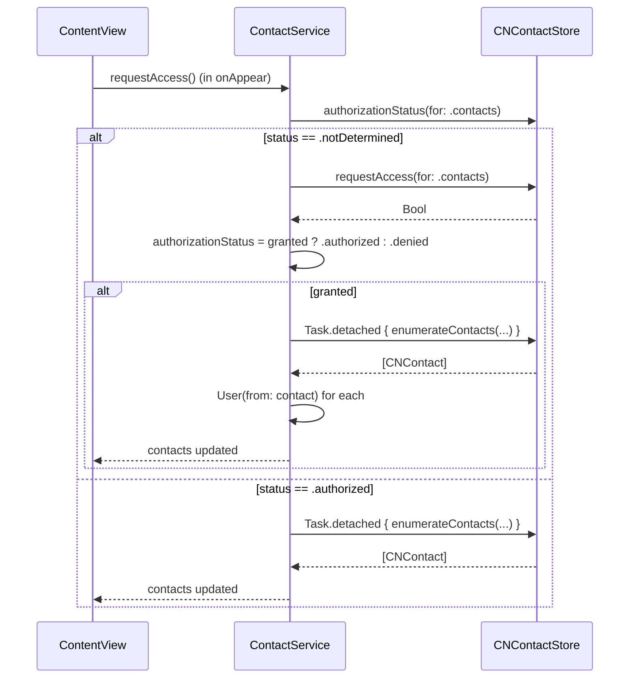
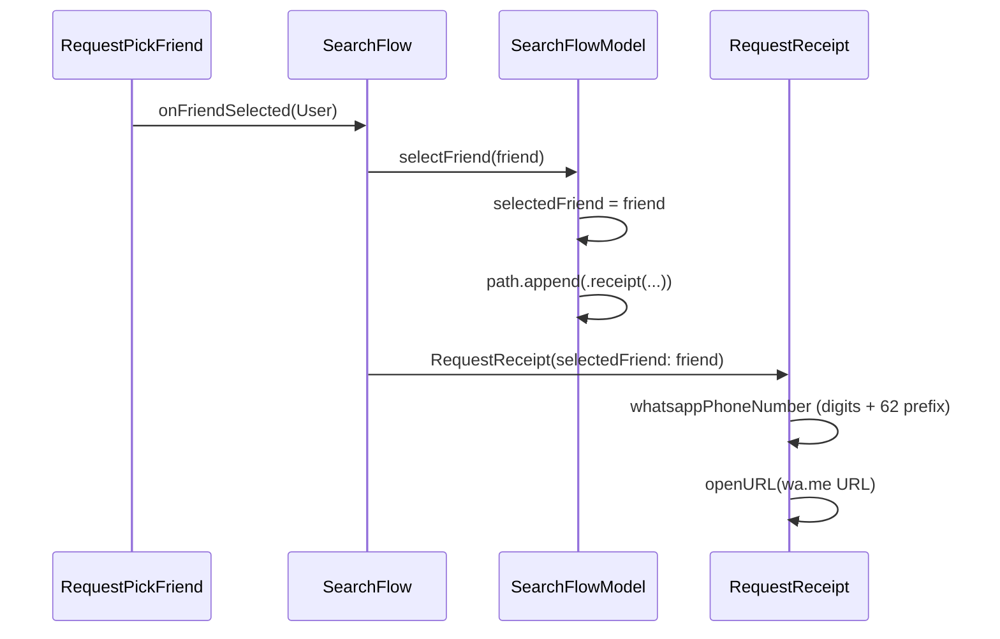

# Contacts Agent Guide

A guide for AI agents working on Contacts-related features in the `challenge-3-personal` Xcode project. This document is derived from the actual implementation and is meant to teach how to extend it correctly, not to document a generic Contacts framework reference.

The companion file `Contacts.md` enumerates every existing Contacts file in the codebase. Read it first for context, then return here for the rules.

---

## 1. Existing Contacts Surface

The project uses the system Contacts framework **only as a one-shot recipient source** for ride-hitch invitations. There is no contact detail screen, no contact editing, no contact picker UI, no favorites, no recents. The architecture is intentionally narrow.

### 1.1 Files that touch contacts

| File | Role |
| --- | --- |
| `Core/Models/ViewModels/ContactService.swift` | The single service. Permission gate, fetch, and `User` array. |
| `Core/Models/Data/User.swift` | The application model. Includes `User.init(from: CNContact)` adapter. |
| `Core/Models/ViewModels/AppStore.swift` | Owns the singleton `ContactService`. |
| `Features/Home/Components/Sheet/FriendMeter.swift` | Horizontal "Friends" carousel on the home sheet. |
| `Features/Home/Components/Sheet/FriendItem.swift` | One cell in the carousel. |
| `Features/Search/Components/FriendCard.swift` | One row in the vertical friend picker. |
| `Features/Search/Views/RequestPickFriend.swift` | Full friend-picker screen with permission states. |
| `Features/Search/Views/RequestReceipt.swift` | Uses the selected `User.phoneNumber` to build a `wa.me` URL. |
| `Features/Search/ViewModels/SearchFlowModel.swift` | Holds the `selectedFriend: User?` selection state. |
| `Features/Search/Views/SearchFlow.swift` | Wires the picker selection into the search flow. |
| `Core/Components/UserAvatarView.swift` | Renders `user.avatarData` (contact thumbnails) when present. |

### 1.2 What is **not** implemented

The following are all genuinely absent and should be confirmed before being added:

- `ContactsUI` (`CNContactPickerViewController`) is not used anywhere. No `import ContactsUI` exists.
- `CNContactViewController` for detail/edit is not used.
- `CNContactStoreDidChangeNotification` is not observed.
- `CNContactStore.unifyResults` is left at its default; there is no unified-contact deduplication.
- `CNContactStore.add(_:)` / `CNMutableContact` is not used. The app is read-only.
- `CNContactVCardSerialization` is not used. No vCard import/export.
- Multiple phone numbers per contact are silently dropped — only `phoneNumbers.first` is read.
- The `isAvailable: Bool` flag is hard-coded to `false` for every contact-sourced `User`.
- No `searchable` modifier is wired up. There is no text search over contacts.

---

## 2. Architecture Overview

### 2.1 Layered diagram

```mermaid
flowchart TB
    subgraph "View Layer"
        CV[ContentView]
        FM[FriendMeter\nhome carousel]
        RPF[RequestPickFriend\npicker screen]
        RR[RequestReceipt]
    end
    subgraph "Flow / ViewModel"
        SF[SearchFlow]
        SFM[SearchFlowModel]
    end
    subgraph "Service Layer"
        CS[ContactService]
        CNS[CNContactStore]
    end
    subgraph "Data Layer"
        U[User]
        CNC[CNContact]
    end

    CV -->|@Environment AppStore| CS
    FM -->|@Environment AppStore| CS
    RPF -->|@Environment AppStore| CS
    SF -->|@Environment AppStore| CS

    RPF -->|onFriendSelected| SF
    SF -->|selectFriend| SFM
    SFM -->|selectedFriend| RR

    CS -->|enumerateContacts| CNS
    CNS -->|CNContact| CS
    CS -->|User.init from:CNContact| U
    U -->|@Observable| CS

    RPF -->|renders| U
    FM -->|renders| U
    RR -->|reads phoneNumber| U
```

The view layer never imports `Contacts` directly except in `RequestPickFriend.swift:2`, which is a no-op import — see §8.1. All Contacts-framework work happens inside `ContactService`.

### 2.2 State ownership rules

```mermaid
flowchart LR
    AS[AppStore\n@State in App] -->|owns| CS[ContactService]
    CV -->|@Environment| AS
    FM -->|@Environment| AS
    RPF -->|@Environment| AS
    SFM -->|@State owns| SFM2[SearchFlowModel]
    RPF -->|closure| SF
    SF -->|closure| SFM
```

- `AppStore` is the **single owner** of `ContactService` (`AppStore.swift:9`).
- `SearchFlowModel` is owned by `SearchFlow` via `@State` and holds the transient `selectedFriend: User?`.
- No `CNContact` value ever escapes the service boundary. The view layer only sees `User`.
- The home view does **not** request contacts on its own; the permission request lives in `ContentView.onAppear` (`ContentView.swift:154-160`).

### 2.3 How contact data flows



The view never observes `authorizationStatus` via `.onChange`. It reads `store.contactService.authorizationStatus` directly inside the body, and SwiftUI's Observation framework re-renders when the property changes.

### 2.4 How selection flows into the ride flow



The selection is propagated through SwiftUI closures and `SearchFlowModel.selectedFriend`, **not** through `ContactService`. The service is the source of the list, not of the selection.

---

## 3. Service Layer Conventions

### 3.1 `ContactService` is the only Contacts authority

- File: `Core/Models/ViewModels/ContactService.swift`
- The class is `@MainActor @Observable final class`.
- It owns the `contacts: [User]` and `authorizationStatus: CNAuthorizationStatus`.
- Permission is requested via `requestAccess() async`, which both reads the current status and triggers the system prompt if needed.
- Contacts are loaded in a `nonisolated private static func loadContacts()` that runs inside `Task.detached(priority: .userInitiated)`. This is the one place where `Task.detached` is acceptable — `CNContactStore.enumerateContacts` is synchronous and blocking.
- The fetch is **one-shot**. There is no observer, no notification, no polling. A new contact added in another app will not appear until the app is relaunched and `requestAccess()` is called again.

**Rule:** Any view that needs contacts must go through `ContactService`. Do not instantiate a second `CNContactStore`.

### 3.2 No additional service currently exists

There is no `ContactMatcher`, no `ContactNormalizer`, no `ContactSearchService`. Phone-number normalization only happens at deep-link time inside `RequestReceipt`. This is intentional but minimal — see §6 and §10.

### 3.3 Public API surface to preserve

| Type | Member | Notes |
| --- | --- | --- |
| `ContactService` | `var contacts: [User]` | The current contact list as app models. |
| `ContactService` | `var authorizationStatus: CNAuthorizationStatus` | Mirror of system status. |
| `ContactService` | `func requestAccess() async` | Idempotent — safe to call multiple times. |
| `ContactService` | `func fetchContacts() async` | Re-runs the fetch. No incremental update. |
| `User` | `init(from contact: CNContact)` | The `CNContact` → `User` adapter. |
| `User` | `var phoneNumber: String?` | First phone number only. |
| `User` | `var avatarData: Data?` | Thumbnail from the contact. |
| `User` | `var isAvailable: Bool` | Always `false` for contact-sourced `User`s. |
| `User` | `Hashable` / `Equatable` | Both based on `id` only. |

Anything not on this list is internal to the file and may be refactored freely.

### 3.4 Async workflow summary

The only async work `ContactService` performs is the contacts fetch. It is wrapped in `Task.detached(priority: .userInitiated)` and assigned to `self.contacts` from the detached task's `.value`. There is no `nonisolated` reads of `self.contacts` — the service is `@MainActor`, so any consumer of `contacts` is implicitly on the main actor.

**Important concurrency note:** assigning to `self.contacts` from inside `Task.detached { ... }.value` works because the assignment happens *after* the `await` on the `.value`, which resumes on the main actor for an `@MainActor` class. Do not move the assignment inside the detached task body — that would cross actors.

---

## 4. View Layer Conventions

### 4.1 Existing screens and their responsibilities

- **`RequestPickFriend`** (`Features/Search/Views/RequestPickFriend.swift`) is the only full contact screen. It handles all four permission states via a `switch store.contactService.authorizationStatus` block, with one `ContentUnavailableView` per case. The `.notDetermined` state is informational only — the actual prompt fires from `ContentView.onAppear`.
- **`FriendMeter`** (`Features/Home/Components/Sheet/FriendMeter.swift`) is a horizontal carousel on the home sheet. It assumes permission is granted (no state guard). If the user denies permission, the carousel simply renders an empty `ForEach`.
- **`FriendItem`** (`Features/Home/Components/Sheet/FriendItem.swift`) and **`FriendCard`** (`Features/Search/Components/FriendCard.swift`) are presentation-only cells. `FriendItem` is a `VStack` of avatar + name. `FriendCard` is an `HStack` of avatar + name + phone.

### 4.2 Reusable UI patterns

The following patterns repeat and should be lifted into shared components when a third view needs them:

1. **Filter and sort over `contactService.contacts`** — exists verbatim in `FriendMeter.swift:14-19` and `RequestPickFriend.swift:71-76`:

   ```swift
   store.contactService.contacts
       .filter { !($0.phoneNumber?.isEmpty ?? true) }
       .sorted { $0.name < $1.name }
   ```

   The current implementation runs on every render. See §7 for the recommended fix.

2. **Permission-state switch** — exists in `RequestPickFriend.swift:47-89`. The four cases (`.notDetermined`, `.denied`/`.restricted`, `.authorized` with empty list, `.authorized` with list) are the canonical pattern. Any new contact screen should follow the same shape.

3. **Selection closure** — every screen that picks a contact exposes a `let onFriendSelected: (User) -> Void` closure. `RequestPickFriend` does this at line 7. Future pickers should follow the same contract.

### 4.3 Contact picker components

There is no dedicated `ContactPickerView` extracted into its own file. `RequestPickFriend` plays that role. If a future feature needs a different picker (e.g. multi-select, or a compact inline picker), it should reuse `RequestPickFriend`'s structure rather than build a parallel permission-state switch.

### 4.4 Search interfaces

There is no contact search UI. The only search-like interaction in the project is over `recentPlaces` (`RequestSearchLocation.swift:46-57`), which is a static list. Adding contact search is a feature for future agents; see §7.1.

---

## 5. State Management Conventions

### 5.1 Observation framework

- `ContactService`, `AppStore`, `SearchFlowModel`, `ContactService` are all `@MainActor @Observable final class` (with `SearchFlowModel` missing `final` — see §8.1).
- `User` and `Place` are plain `struct` value types. They are `Identifiable` and `Hashable`.
- `User` is read from `ContactService.contacts`, which is the only published source of contact data.
- Selection is **not** stored on `ContactService`. It lives on `SearchFlowModel.selectedFriend` as a plain `User?`.

### 5.2 Environment dependencies

`AppStore` is the only environment value. Contact-aware views read `store.contactService` through `@Environment(AppStore.self)`. They never read from `ContactService` directly.

### 5.3 Dependency injection

`AppStore.init(...)` accepts an optional `contactService: ContactService?` (`AppStore.swift:19`). Tests and previews can inject a fake or empty service. The default initializer constructs a real `ContactService`. Any future service you build should follow the same pattern.

`ContactService` itself has no dependencies to inject — it constructs its own `CNContactStore` inside the detached task (`ContactService.swift:44`). This is acceptable because `CNContactStore` is a thin wrapper around a system daemon.

### 5.4 Concurrency

- `ContactService.requestAccess()` and `fetchContacts()` are `async`.
- The actual enumeration runs on a `Task.detached(priority: .userInitiated)`. The `nonisolated` static `loadContacts()` is correctly marked.
- The view layer kicks off `requestAccess()` from a `Task { await store.contactService.requestAccess() }` inside `ContentView.onAppear` (`ContentView.swift:157-159`).
- There is no SwiftData persistence, no `ModelContext`, no `@AppStorage`. The contact list is purely in-memory.

---

## 6. Contacts Framework Integration

### 6.1 `CNContactStore`

`CNContactStore` is used in two places, both inside `ContactService`:

1. `CNContactStore().requestAccess(for: .contacts)` at `ContactService.swift:23` for the permission prompt.
2. A fresh `CNContactStore()` constructed inside `Task.detached` at `ContactService.swift:44` for the actual fetch.

There is no shared `CNContactStore` instance, no long-lived property. This is fine — `CNContactStore` is documented as safe to instantiate multiple times.

### 6.2 Permission requests

`ContactService.requestAccess()` is the only entry point. It:

1. Reads `CNContactStore.authorizationStatus(for: .contacts)` to seed the published `authorizationStatus`.
2. Branches on the result:
   - `.authorized` → calls `fetchContacts()`.
   - `.notDetermined` → calls `requestAccess(for:)`, updates status, fetches on grant.
   - `.denied` / `.restricted` (the `default`) → no-op.

The view layer in `RequestPickFriend.swift:48-88` matches on `authorizationStatus` and shows a `ContentUnavailableView` per case.

### 6.3 Contact fetching

`ContactService.loadContacts()` (private static, `nonisolated`) builds a `CNContactFetchRequest(keysToFetch:)` with exactly four keys:

- `CNContactGivenNameKey`
- `CNContactFamilyNameKey`
- `CNContactThumbnailImageDataKey`
- `CNContactPhoneNumbersKey`

It then calls `store.enumerateContacts(with: request)` synchronously and maps each `CNContact` to a `User` via `User.init(from:)`. The whole thing is wrapped in `Task.detached(priority: .userInitiated)`.

### 6.4 Contact containers

`CNContactStore.containers(matching:)` is **not** called. The fetch goes against the unified address book. A future feature that needs to filter by container (e.g. iCloud vs. Exchange) would need to add a parameter here.

### 6.5 Contact keys

Only the four keys above are requested. This is a deliberate minimum: name + thumbnail + first phone number is all the rest of the app consumes. Adding more keys (e.g. `CNContactEmailAddressesKey`, `CNContactPostalAddressesKey`, `CNContactOrganizationNameKey`) will increase fetch time and memory proportionally. Only add a key when a feature that consumes it is in the same change.

### 6.6 Performance considerations

- The fetch is one-shot and synchronous inside a detached task. The system can take 100s of milliseconds for a 1,000-contact address book.
- There is no incremental update. The full `[User]` is rebuilt on every `fetchContacts()` call.
- There is no pagination. The `List` in `RequestPickFriend` is a plain `List` and will materialize all rows. For an address book of 5,000+ contacts, you would need to switch to `List` with a fetched-results controller or virtualize differently. This is acceptable today because the app filters out contacts without phone numbers, which typically trims the list significantly.

### 6.7 `ContactsUI`

Not used. The project deliberately does not surface `CNContactPickerViewController`. If a future feature needs the system picker, wrap it in a `UIViewControllerRepresentable` and put the wrapper in `Core/Contacts/`. Do not import `ContactsUI` from a feature view.

### 6.8 Phone number handling

Phone numbers are stored on `User.phoneNumber: String?` as the verbatim `CNPhoneNumber.stringValue` of the first `CNLabeledValue` (`User.swift:48`).

There is no E.164 normalization, no `libphonenumber` integration, no validation. The only transformation is in `RequestReceipt.whatsappPhoneNumber` (`RequestReceipt.swift:40-53`):

- Strips non-digits with `.filter(\.isNumber)`.
- If the result starts with `62`, returns it as-is.
- If the result starts with `0`, replaces the leading `0` with `62` (Indonesian country code).
- Otherwise returns the digits unchanged.

**Rule:** any new feature that needs to compare or send a phone number must run it through a normalizer. The current `whatsappPhoneNumber` logic should be lifted into a free function or a `PhoneNumberFormatter` type and reused everywhere (see §10.1).

---

## 7. Performance Guidelines

### 7.1 Filter+sort on every render

`FriendMeter.swift:14-19` and `RequestPickFriend.swift:71-76` both apply `.filter { ... }.sorted { ... }` inside their view body. The filter+sort runs on every recomposition. For a 500-contact address book this is fine; for 5,000 it starts to matter.

**Recommended fix:** add a computed property to `ContactService`:

```swift
var displayableContacts: [User] {
    contacts
        .filter { !($0.phoneNumber?.isEmpty ?? true) }
        .sorted { $0.name < $1.name }
}
```

Then both views call `store.contactService.displayableContacts` instead of re-doing the work.

### 7.2 Lazy loading

The current implementation does an eager full fetch. There is no lazy loading. If the address book is large, consider:

- Using `CNContactStore` change notifications to invalidate a cache.
- Lazy-loading per section (e.g. A-C, D-F, ...) with `Section`s and lazy data sources.
- Using SwiftData with a `ModelContext` so contacts can be paged from disk.

None of these are required today. Flag this as a concern only when the contact list grows past ~2,000 entries.

### 7.3 Search optimization

There is no contact search today. If you add one, follow these rules:

- Debounce input by ~200 ms before issuing a new `CNContactFetchRequest` with a `predicateForContacts(matchingName:)`.
- Filter the in-memory `[User]` first, fall back to the framework only when the local result is empty.
- Never call `CNContactStore` from inside a SwiftUI view body.

### 7.4 Contact caching

There is no on-disk cache. `ContactService.contacts` is purely in-memory. A future SwiftData migration is the natural place to add a cache, but until then, do not add `UserDefaults` or file-based caching — the framework provides no notification of changes, so any cache would be stale.

### 7.5 Memory management

- The detached task body constructs a `var fetched: [User] = []` and appends. This is fine for the expected contact counts. For very large address books, consider a stream-based approach instead of building a single array.
- `CNContact` is a class type with reference semantics. The current code converts each to a `User` value type inside the enumeration, so no `CNContact` escapes the service. Maintain this invariant.

---

## 8. Common Pitfalls

### 8.1 Existing technical debt

- **Duplicated filter+sort** in two views (see §7.1). Future screen will create a third copy. Extract `displayableContacts`.
- **Phone-number normalization only at deep-link time.** Anything that compares phone numbers must re-implement the same `digits + 62 prefix` logic, or do its own (inconsistent) version. Extract `PhoneNumberFormatter`.
- **The `UserDefaults`-style `INFOPLIST_KEY_NSContactsUsageDescription` is self-referential** in `challenge-3-personal.xcodeproj/project.pbxproj:258, 292`. The iOS permission prompt will show the literal string `INFOPLIST_KEY_NSContactsUsageDescription` to the user. Replace with a real description.
- **No `CNContactStoreDidChangeNotification` observer.** A user adding a contact in another app will not see it in Hitch until relaunch. The fix is one observer + `Task { await fetchContacts() }`.
- **`User.location` is dead.** Never written, never read. If a future feature needs a contact's location, add a separate `lastKnownLocation: CLLocationCoordinate2D?` field that `LocationService` populates via a callback — do not repurpose `User.location`.
- **`SearchFlowModel` is not `final`.** All peer models are `final class`. Add `final` for consistency.
- **Filter+sort runs on every render** (see §7.1).
- **`import Contacts` in `RequestPickFriend.swift:2` is unused.** The view only references `User` and `ContactService.authorizationStatus` (which is the system's `CNAuthorizationStatus` exposed through the service). Remove the import.
- **`ContactService.fetchContacts` swallows errors with `print`.** Surface an `Error?` published property for the view layer to render an alert.
- **`List` row in `RequestPickFriend` uses `.onTapGesture`** (`RequestPickFriend.swift:80-82`). The code review flags this as an accessibility issue — wrap in `Button { onFriendSelected(friend) } label: { ... }.buttonStyle(.plain)`.

### 8.2 Architectural constraints

- **iOS 26+ is the deployment target.** Use `ContentUnavailableView`, the Observation framework, and the modern `import Contacts` async APIs. Do not fall back to `CNContactStore` + delegate unless the user explicitly asks for a non-async flow.
- **No third-party frameworks.** No `libphonenumber-swift`, no `ContactsKit`, no SwiftData wrappers. If a future feature needs library-grade phone-number handling, ask first.
- **No SwiftData yet.** If you add SwiftData, you must also decide how `ContactService` and `AppStore` will read from a `ModelContext`. Do not silently start writing to SwiftData from `ContactService`.
- **Single `ContactService`.** `AppStore` owns it. Do not create a second one in a feature folder.

### 8.3 Areas to modify only with caution

- `ContactService.loadContacts()` (private static). The detached task + `nonisolated` boundary is the correct shape. Do not move the assignment to `self.contacts` inside the detached task body — that would cross actors.
- `User.init(from: CNContact)` (`User.swift:42-58`). The current mapping is intentionally narrow (name + first phone + thumbnail). Any expansion must be backwards-compatible — mock `User`s in `AppStore.mock()` should not break.
- `RequestReceipt.whatsappPhoneNumber` (`RequestReceipt.swift:40-53`). The Indonesian `0` → `62` rewrite is correct for the target market. If the app ships in other regions, this becomes a per-locale normalizer.
- The `authorizationStatus` switch in `RequestPickFriend.swift:48-88`. The four cases are the canonical pattern. Any new contact screen should follow the same shape with the same copy.
- `AppStore.mock()` does not seed `contactService` — it leaves the default empty `ContactService`. Tests/previews that need a populated list must construct their own `ContactService` with mocked contacts.

### 8.4 Things future agents commonly get wrong

- **Treating `User` as if it were a contact.** It is the app model. `User` is shared with mock friends, contact-sourced friends, and the current user. Do not put contact-specific fields on `User` (e.g. `CNContactIdentifier`) — that couples the model to the framework.
- **Storing `CNContact` in `@State` or in a view model.** Always convert to `User` at the service boundary. The framework types have reference semantics and can change behind your back.
- **Forgetting that `phoneNumber` is `String?` and can be empty.** Always check for nil **and** empty (the existing code does `!($0.phoneNumber?.isEmpty ?? true)`).
- **Calling `requestAccess()` from a button tap.** The current contract is: `requestAccess()` is called once from the app root. The view then reacts to the published `authorizationStatus`. Re-prompting from a button will surface iOS's "denied twice" behavior. The deny-state UI should point the user to Settings, not re-prompt.
- **Re-fetching contacts on every contact-list render.** The `[User]` is already in `ContactService.contacts`. Read it.

---

## 9. Data Flow Summary

1. **Permission requested** — `ContentView.onAppear` calls `Task { await store.contactService.requestAccess() }` (`ContentView.swift:157-159`).
2. **Contacts fetched from device** — `ContactService.requestAccess()` reads the system status. If `.notDetermined`, it calls `CNContactStore().requestAccess(for: .contacts)`. On grant, it calls `fetchContacts()`, which dispatches `Task.detached { loadContacts() }` to fetch via `enumerateContacts`.
3. **Contacts mapped into app models** — Inside the detached task, each `CNContact` is converted via `User.init(from: contact)` (`User.swift:42-58`). Only `name`, `phoneNumber`, `avatarData`, and `isAvailable = false` are extracted.
4. **Contacts stored in state** — The `[User]` is assigned to `self.contacts` on the main actor. SwiftUI re-renders every view that observed `contactService.contacts`.
5. **Search/filter applied** — The view layer filters out empty phone numbers and sorts alphabetically. This logic is duplicated; see §7.1.
6. **User selects contact** — The row's `.onTapGesture` (or, after the refactor, a `Button`) invokes the `onFriendSelected(friend)` closure. The closure is wired to `SearchFlowModel.selectFriend(_:)` by the parent.
7. **Contact passed into downstream features** — `SearchFlowModel.selectedFriend` is read by `RequestReceipt` to build the WhatsApp deep link and to display the friend in the receipt header.

---

## 10. Feature Development Guidelines

### 10.1 Adding contact search

There is no contact search today. To add one:

1. Add `var searchQuery: String` to a new `ContactSearchModel` (do not grow `ContactService` with view state).
2. Add a `func matches(_ query: String) async -> [User]` to `ContactService` that uses `CNContactStore.unifiedContacts(matching:)` with a `CNContactPredicate` built from `query`. Or, for simplicity, filter the existing `[User]` with `localizedStandardContains()`.
3. In the view, debounce the input by ~200 ms with a `Task` cancellation pattern.
4. Render the result list with the same `List` + `FriendCard` pattern used in `RequestPickFriend.swift:71-85`.
5. Empty-state copy should match the existing `ContentUnavailableView` style.

**Important:** the project rule for user-input filtering is `localizedStandardContains()`. Do not use plain `contains()` or `localizedCaseInsensitiveContains()`.

### 10.2 Adding selection (single, multi, state management)

- **Single selection** is already implemented via `onFriendSelected: (User) -> Void`. Reuse this pattern.
- **Multi-selection** would require:
  1. A `var selectedFriendIDs: Set<UUID>` on the view model.
  2. A `Binding<Set<UUID>>` passed into the picker so the view can render checkmarks.
  3. A new closure `onFriendsSelected: ([User]) -> Void` for the confirmation action.
- **State management rule:** selection state lives on the flow's view model (`SearchFlowModel`-equivalent), not on `ContactService`. The service is the source of the list, not of the selection.

### 10.3 Adding friend features (contact-to-user matching, invitations)

The current flow is:

1. `RequestPickFriend` displays contacts as `User`s.
2. The user picks one.
3. `RequestReceipt` opens a `wa.me` deep link to the picked `User.phoneNumber`.

To extend this (e.g. saving the contact as a "friend" in `AppStore.friends`):

1. Add the picked contact to `AppStore.friends` via a method on the store: `func addFriend(_ user: User)`.
2. Persist `AppStore.friends` to SwiftData when SwiftData is added.
3. For contact-to-user matching (e.g. "is this contact already a friend?"), use `User.id` (UUID). Do not match on phone number — the existing IDs are generated locally and are not shared with the system contact.
4. For invitation workflows, treat the `wa.me` deep link as the invitation. There is no in-app message thread.

### 10.4 Adding contact detail screens

There is no detail screen today. To add one:

1. Add a new `case .contactDetail(friend: User)` to `SearchStep` (or whatever enum drives your navigation).
2. Create `Features/Search/Views/ContactDetailView.swift` that takes a `User` and a back closure.
3. The view shows the avatar at full size, the phone number, and the address (if any — currently contacts have no address).
4. Add a tap target on `FriendCard` to push the detail route.
5. The data ownership rule: the view receives the `User` by value. It does not call back into `ContactService`.

### 10.5 Future integrations

#### 10.5.1 SwiftData

- Promote `User` to an `@Model` class. Keep the `id`, `name`, `phoneNumber`, `avatarData` fields. Mark all properties optional or default-valued (CloudKit rules apply if CloudKit is on).
- Add a `@MainActor @Observable` `ContactsStore` that owns a `ModelContext` and provides the same surface as the current `ContactService`.
- During the migration, keep `ContactService` as a compatibility shim that reads from `ContactsStore`. The view layer keeps reading `store.contactService.contacts`.
- Do not add `@Attribute(.unique)` on the model — see the project's CloudKit constraint.

#### 10.5.2 CloudKit

- The agent guide rules say: "If SwiftData is configured to use CloudKit, never use `@Attribute(.unique)`, mark all model properties optional or with defaults, and mark all relationships optional." The current project does not use CloudKit. If you turn it on, audit `User` for these rules.

#### 10.5.3 QR workflows

- A QR workflow for inviting a contact would produce a payload that is decoded into a `User` and added to `AppStore.friends`.
- Reuse the `User` initializer with `avatarURL` for the QR-provided avatar. Do not invent a separate `QRContact` type.

#### 10.5.4 Ride-sharing flows

- The current code already wires contacts into the ride flow through `RequestReceipt`. Adding multi-passenger rides would require a `[User]` selection on the picker.
- Reuse the `selectedFriend` storage on `SearchFlowModel` — extend it to `[User]`.

#### 10.5.5 Payment flows

- The current `RequestReceipt` only uses `User.phoneNumber` to open WhatsApp. A real payment flow would need bank details, which are not in `CNContact` (Apple Pay contact fields are read-only and not exposed by `Contacts`).
- For payment, use Apple's `PassKit` or a third-party payments SDK. Do not add payment fields to `User` based on `CNContact` properties — they do not exist there.

#### 10.5.6 Invitation systems

- The current "invitation" is the WhatsApp deep link. A real invitation system would track who was invited and whether they accepted.
- Add a `Ride.invitedFriends: [User]` field on `Ride` (or a separate `Invitation` model). Persist via SwiftData when added.

---

## 11. Worked Examples

### 11.1 Request contact permissions (current pattern)

`ContactService.swift:15-32`:

```swift
func requestAccess() async {
    authorizationStatus = CNContactStore.authorizationStatus(for: .contacts)

    switch authorizationStatus {
    case .authorized:
        await fetchContacts()
    case .notDetermined:
        do {
            let granted = try await CNContactStore().requestAccess(for: .contacts)
            authorizationStatus = granted ? .authorized : .denied
            if granted { await fetchContacts() }
        } catch {
            authorizationStatus = .denied
        }
    default:
        break
    }
}
```

The call site, `ContentView.swift:157-159`:

```swift
Task {
    await store.contactService.requestAccess()
}
```

### 11.2 Fetch contacts (current pattern)

`ContactService.swift:34-60`:

```swift
func fetchContacts() async {
    do {
        contacts = try await Self.loadContacts()
    } catch {
        print("Failed to fetch contacts: \(error)")
    }
}

nonisolated private static func loadContacts() async throws -> [User] {
    try await Task.detached(priority: .userInitiated) {
        let store = CNContactStore()
        let keys: [CNKeyDescriptor] = [
            CNContactGivenNameKey as CNKeyDescriptor,
            CNContactFamilyNameKey as CNKeyDescriptor,
            CNContactThumbnailImageDataKey as CNKeyDescriptor,
            CNContactPhoneNumbersKey as CNKeyDescriptor
        ]
        let request = CNContactFetchRequest(keysToFetch: keys)

        var fetched: [User] = []
        try store.enumerateContacts(with: request) { contact, _ in
            fetched.append(User(from: contact))
        }

        return fetched
    }.value
}
```

### 11.3 Map `CNContact` to `User` (current pattern)

`User.swift:42-58`:

```swift
extension User {
    init(from contact: CNContact) {
        let fullName = [contact.givenName, contact.familyName]
            .filter { !$0.isEmpty }
            .joined(separator: " ")

        let phone = contact.phoneNumbers.first?.value.stringValue
        let avatarData = contact.thumbnailImageData

        self.init(
            name: fullName.isEmpty ? "Unknown" : fullName,
            avatarData: avatarData,
            phoneNumber: phone,
            isAvailable: false   // Contacts don't have real-time availability
        )
    }
}
```

### 11.4 Filter contacts (current pattern)

`RequestPickFriend.swift:73-75` and `FriendMeter.swift:15-17` (duplicated):

```swift
.filter { !($0.phoneNumber?.isEmpty ?? true) }
```

**Recommended (after §10.1):** move into `ContactService.displayableContacts` and read from there.

### 11.5 Sort contacts alphabetically (current pattern)

`RequestPickFriend.swift:76` and `FriendMeter.swift:18` (duplicated):

```swift
.sorted { $0.name < $0.name }
```

**Recommended:** make `User` conform to `Comparable` by `name` and use `.sorted()`. Or move into `ContactService.displayableContacts`.

### 11.6 Select a contact (current pattern)

`RequestPickFriend.swift:77-82`:

```swift
FriendCard(friend: friend)
    .frame(maxWidth: .infinity, alignment: .leading)
    .contentShape(Rectangle())
    .onTapGesture {
        onFriendSelected(friend)
    }
```

**Recommended (after the code review):**

```swift
Button {
    onFriendSelected(friend)
} label: {
    FriendCard(friend: friend)
        .frame(maxWidth: .infinity, alignment: .leading)
        .contentShape(Rectangle())
}
.buttonStyle(.plain)
```

The wiring, `SearchFlow.swift:38-42`:

```swift
RequestPickFriend(
    selectedPlace: place,
    onFriendSelected: { friend in
        model.selectFriend(friend)
    },
    onBack: { model.path.removeLast() },
    currentLocation: mapModel.currentLocationAddress
)
```

`SearchFlowModel.swift:17-21`:

```swift
func selectFriend(_ friend: User) {
    selectedFriend = friend
    guard let place = selectedPlace else { return }
    path.append(.receipt(selectedPlace: place, selectedFriend: friend))
}
```

### 11.7 Pass a selected contact to another feature (current pattern)

The selected `User` flows into `RequestReceipt` via the `SearchStep` enum (`SearchStep.swift:13-14`):

```swift
case receipt(selectedPlace: Place, selectedFriend: User)
```

Then `RequestReceipt` reads the friend's `phoneNumber` to build the WhatsApp deep link (`RequestReceipt.swift:40-53`):

```swift
private var whatsappPhoneNumber: String? {
    let digits = selectedFriend.phoneNumber?.filter(\.isNumber) ?? ""
    guard !digits.isEmpty else { return nil }

    if digits.hasPrefix("62") {
        return digits
    }

    if digits.hasPrefix("0") {
        return "62" + digits.dropFirst()
    }

    return digits
}
```

And opens the URL on the **Send Request** button tap (`RequestReceipt.swift:199-204`):

```swift
Button("Send Request") {
    onSend()

    guard let whatsappURL else { return }
    openURL(whatsappURL)
}
```

### 11.8 Add a new contact-aware screen (skeleton)

Suppose a future feature needs a "blocked contacts" screen. The skeleton, in `Features/Blocked/Views/BlockedContactsView.swift`:

```swift
import SwiftUI

struct BlockedContactsView: View {
    @Environment(AppStore.self) private var store

    var body: some View {
        Group {
            switch store.contactService.authorizationStatus {
            case .notDetermined:
                ContentUnavailableView(
                    "Contacts Access",
                    systemImage: "person.crop.circle.badge.plus",
                    description: Text("Allow access to manage blocked contacts.")
                )
            case .denied, .restricted:
                ContentUnavailableView(
                    "Access Denied",
                    systemImage: "lock.fill",
                    description: Text("Enable contacts access in Settings.")
                )
            case .authorized:
                List(store.contactService.displayableContacts) { contact in
                    Button {
                        // toggle blocked state
                    } label: {
                        FriendCard(friend: contact)
                    }
                    .buttonStyle(.plain)
                }
                .listStyle(.plain)
            @unknown default:
                EmptyView()
            }
        }
        .navigationTitle("Blocked Contacts")
    }
}
```

The new screen reuses:

- `AppStore` via `@Environment`.
- `ContactService.authorizationStatus` and `.displayableContacts` (after the §10.1 refactor).
- `FriendCard` for each row.
- The same four-case `ContentUnavailableView` permission pattern.

It does **not**:

- Import `Contacts` directly.
- Construct a second `CNContactStore`.
- Filter or sort inline.
- Re-implement the WhatsApp-style phone-number transformation.

---

## 12. Recommended Future Refactors (Prioritized)

1. **Add `ContactService.displayableContacts`** as a computed property that filters empty phones and sorts by name. Replace the two duplicated inline expressions in `FriendMeter` and `RequestPickFriend`. Saves work on every render and centralizes the rule.
2. **Extract `PhoneNumberFormatter`** in `Core/Contacts/`. Move `RequestReceipt.whatsappPhoneNumber` into a static method. The WhatsApp link is the only consumer today, but a future feature (call, SMS, payment) will need the same logic.
3. **Wrap rows in `Button { ... }.buttonStyle(.plain)`** in `RequestPickFriend.swift:77-82`. Fixes the `.onTapGesture` accessibility issue and is a one-line change.
4. **Remove the unused `import Contacts`** at `RequestPickFriend.swift:2`. The view never references the framework directly.
5. **Add `final` to `SearchFlowModel`** (`SearchFlowModel.swift:6`). Trivial fix for consistency.
6. **Replace the self-referential `INFOPLIST_KEY_NSContactsUsageDescription`** in `challenge-3-personal.xcodeproj/project.pbxproj:258, 292` with a real description string. The current value surfaces the literal key name to the user in the iOS prompt.
7. **Subscribe to `CNContactStoreDidChangeNotification`** in `ContactService.setupIfNeeded()` and re-fetch on change. The user adding a contact in another app will then see it in Hitch.
8. **Publish fetch errors.** Replace `print("Failed to fetch contacts: ...")` in `ContactService.swift:38` with a published `Error?` that the view layer can render as an alert.
9. **Remove dead `User.location`** (`User.swift:11`) once the model has been audited. If a future feature needs a contact's location, add a separate `lastKnownLocation: CLLocationCoordinate2D?` field that `LocationService` populates via a callback.
10. **Plan a SwiftData migration.** When adopted, promote `User` to an `@Model`, add a `ContactsStore` that wraps a `ModelContext`, and keep `ContactService` as a thin shim that reads from `ContactsStore` so the view layer does not change.
