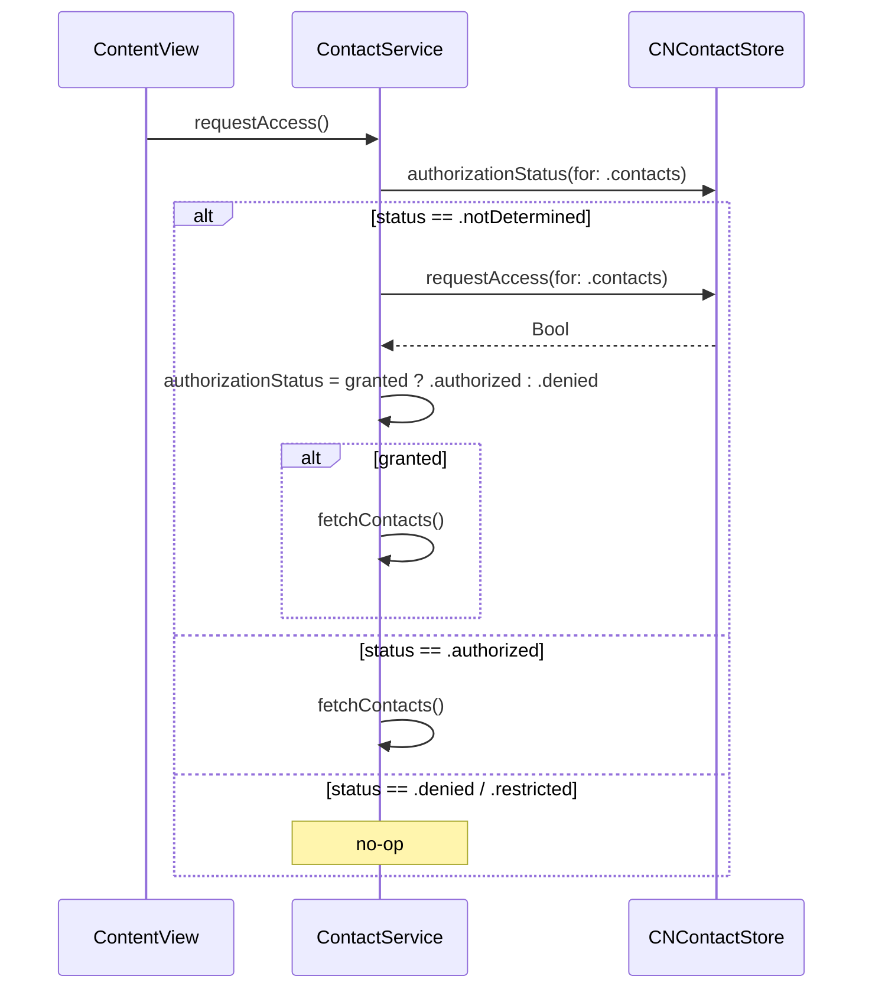
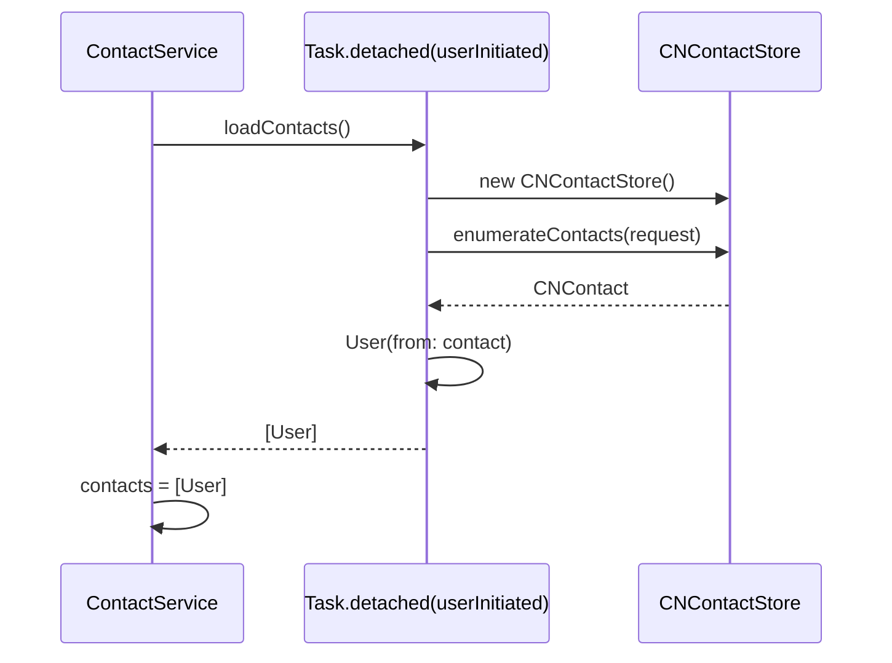

# Contacts Documentation

Comprehensive documentation of every Contact-related implementation in the `challenge-3-personal` Xcode project. This document is based strictly on the code that currently exists in the repository.

---

## 1. Overview

### 1.1 Purpose of Contacts in this project

Contacts are used to power the **friend-picker** surface of the hitch ride-hailing flow. The Hitch app needs to identify which device contacts are available to receive a ride request. To do that, it:

1. Asks the user for `Contacts` permission.
2. Reads the device's contact list.
3. Transforms each `CNContact` into a `User` value-type.
4. Filters and sorts those users by name.
5. Displays them in two places: a horizontal "Friends" carousel on the home sheet, and a vertical list inside the search flow's friend picker.
6. Uses the chosen contact's phone number to construct a WhatsApp deep link in the receipt step.

Contacts are **not** used for messaging, calling, or syncing back to the device. They are a read-only source of recipient information.

### 1.2 High-level contact flow

```mermaid
flowchart LR
    App[challenge_3_personalApp] -->|@State| Store[AppStore]
    Store -->|owns| CS[ContactService]
    CS -->|contacts: [User]| CS1[loadContacts nonisolated]
    CS1 -->|enumerateContacts| CN[CNContactStore]
    CN -->|CNContact| Map[User.init from CNContact]
    Map -->|User values| CS
    CS -->|@Observable| Views
    Views -->|display| FM[FriendMeter carousel]
    Views -->|display| PF[RequestPickFriend list]
    PF -->|onFriendSelected| Flow[SearchFlowModel]
    Flow -->|selectedFriend| Receipt[RequestReceipt]
    Receipt -->|wa.me URL| WA[WhatsApp]
```

The runtime sequence is:

1. `challenge_3_personalApp` instantiates `AppStore.mock()`, which transitively creates a `ContactService`.
2. `ContentView.onAppear` awaits `store.contactService.requestAccess()` to kick off the permission flow.
3. The user accepts (or denies) the iOS prompt.
4. On acceptance, `ContactService.fetchContacts()` reads the address book off the main actor and stores the result in `contacts: [User]`.
5. `FriendMeter` and `RequestPickFriend` observe `store.contactService.contacts` and re-render when it changes.
6. Tapping a contact in `RequestPickFriend` invokes `onFriendSelected(friend)`, which propagates the chosen `User` through `SearchFlowModel` into `RequestReceipt`, where the phone number is reformatted and opened as a `https://wa.me/...` URL.

### 1.3 Integration with other modules

| Module | How it uses contacts |
| --- | --- |
| `AppStore` | Owns the `ContactService` instance (`AppStore.swift:9`). |
| `ContentView` | Triggers `requestAccess()` on appear (`ContentView.swift:158`). |
| `FriendMeter` | Renders the horizontal "Friends" carousel using `contactService.contacts` (`FriendMeter.swift:14`). |
| `RequestPickFriend` | The full friend-picker screen; gates on `authorizationStatus` and renders an empty state when `contacts.isEmpty` (`RequestPickFriend.swift:47-89`). |
| `SearchFlow` | Owns the `SearchFlowModel` that tracks the `selectedFriend` (`SearchFlow.swift:38-42`). |
| `RequestReceipt` | Uses the selected `User.phoneNumber` to build a WhatsApp deep link (`RequestReceipt.swift:40-67`). |
| `User` | Holds phone number + display name + avatar data; the destination model for `CNContact` (`User.swift:42-58`). |

---

## 2. Contact Features

The following subsections document every contact-related capability actually present in the codebase. Features that do **not** exist are explicitly listed as not implemented.

### 2.1 Contact permission handling

- **Implementation:** `ContactService.requestAccess()` (`ContactService.swift:15-32`).
- Reads `CNContactStore.authorizationStatus(for: .contacts)` and branches on the result.
  - `.authorized` → calls `fetchContacts()` directly.
  - `.notDetermined` → calls `CNContactStore().requestAccess(for: .contacts)` asynchronously, updates `authorizationStatus`, and fetches on grant.
  - `.denied` / `.restricted` (the `default` branch) → no-op.
- The view layer in `RequestPickFriend.swift:48-88` reads `store.contactService.authorizationStatus` and renders a different `ContentUnavailableView` for each of `.notDetermined`, `.denied`/`.restricted`, and `.authorized`. The "no contacts" state is a sub-case of `.authorized` when `contacts.isEmpty`.

### 2.2 Contact fetching and loading

- **Implementation:** `ContactService.fetchContacts()` delegates to a `nonisolated private static func loadContacts()` (`ContactService.swift:34-60`).
- Uses `Task.detached(priority: .userInitiated)` to perform the fetch off the main actor.
- Builds a `CNContactFetchRequest(keysToFetch:)` with four keys:
  - `CNContactGivenNameKey`
  - `CNContactFamilyNameKey`
  - `CNContactThumbnailImageDataKey`
  - `CNContactPhoneNumbersKey`
- Calls `store.enumerateContacts(with: request)` synchronously inside the detached task, mapping every `CNContact` to a `User` via `User(from: contact)`.
- Re-throws and prints the error if the fetch fails (`print("Failed to fetch contacts: \(error)")`).

### 2.3 Contact searching and filtering

- **Text-based search:** **Not implemented.** No `TextField` or search bar is wired up to `ContactService.contacts`.
- **Filtering:** Both UI surfaces filter out contacts with an empty `phoneNumber`:
  - `RequestPickFriend.swift:73-75`: `.filter { !($0.phoneNumber?.isEmpty ?? true) }`
  - `FriendMeter.swift:15-17`: same filter.

### 2.4 Contact sorting

- **Implementation:** Both UI surfaces sort the filtered list alphabetically by name:
  - `RequestPickFriend.swift:76`: `.sorted { $0.name < $1.name }`
  - `FriendMeter.swift:18`: `.sorted { $0.name < $1.name }`
- Sorting is performed on every render. There is no precomputed sort cache.

### 2.5 Contact selection

- **Implementation:** `RequestPickFriend` exposes a `let onFriendSelected: (User) -> Void` closure (`RequestPickFriend.swift:7`).
- The list row's `.onTapGesture { onFriendSelected(friend) }` (`RequestPickFriend.swift:80-82`) fires the closure.
- The chosen `User` is forwarded to `SearchFlowModel.selectFriend(_:)` (`SearchFlowModel.swift:17-21`), which appends `.receipt(selectedPlace:selectedFriend:)` to the navigation path.

### 2.6 Contact display in lists

- **Vertical list (friend picker):** `List` with `.listStyle(.plain)` rendering `FriendCard` for each contact (`RequestPickFriend.swift:71-85`).
- **Horizontal carousel:** `ScrollView(.horizontal)` with `.scrollIndicators(.hidden)` rendering `FriendItem` for each contact (`FriendMeter.swift:12-27`).

### 2.7 Contact detail presentation

- **Not implemented.** Tapping a contact does not open a detail view. The tap selects the contact and dismisses/advances the picker. There is no edit screen, no read-only detail view, and no system contact card.

### 2.8 Phone number handling

- **Storage:** `User.phoneNumber: String?` is the canonical storage (`User.swift:10`). The string is taken verbatim from `contact.phoneNumbers.first?.value.stringValue` (`User.swift:48`).
- **Filtering:** A contact is only displayed if `phoneNumber` is non-nil and non-empty (see 2.3).
- **Display:** `FriendCard` shows the phone number as a secondary line when present (`FriendCard.swift:17-21`).
- **Reformatting for WhatsApp:** `RequestReceipt.whatsappPhoneNumber` (`RequestReceipt.swift:40-53`) strips non-digits and converts the leading `0` to `62` (Indonesian country code) or preserves an existing `62` prefix. The resulting number is used to build `https://wa.me/<digits>?text=<message>`.

### 2.9 Contact synchronization

- **Not implemented.** The app does not call `CNContactStore` change notifications, does not subscribe to `CNContactStoreDidChange`, and does not re-fetch contacts at any interval. Contacts are loaded once after permission is granted and stay in memory.

### 2.10 Contact importing/exporting

- **Not implemented.** There is no UI for importing contacts, no vCard export, no `CNContactVCardSerialization`, and no use of `CNContactStore.add(_:)` or `CNMutableContact`.

### 2.11 Favorites, recent contacts, or custom grouping

- **Not implemented.** No "favorites," "recents," or grouping concept exists in the code. The only grouping is the visual split between the horizontal carousel (`FriendMeter`) and the vertical list (`RequestPickFriend`), and the mock data contains an `isAvailable: Bool` flag that is currently unused for grouping (the `Nearby` label is commented out in `FriendItem.swift:15-20`).

### 2.12 Other contact-related capabilities

- **System contact picker:** **Not implemented.** `CNContactPickerViewController` from `ContactsUI` is never instantiated; no `UIViewControllerRepresentable` wrapper exists.
- **Contact editing:** **Not implemented.**
- **Group containers:** **Not implemented.** `CNContactStore.containers(matching:)` is not called; the fetch is over the unified address book.
- **Unified contact unification:** Not configured. `CNContactFetchRequest.unifyResults` is left at its default (`true`).
- **Sort order from Contacts framework:** The fetch is run with the default `CNContactSortOrder` (none specified).

---

## 3. Framework Usage

### 3.1 Contacts Framework (`CNContactStore`)

The project uses only the foundation-level Contacts framework. There is no `ContactsUI` integration.

- `CNContactStore` is used in two places:
  - `ContactService.requestAccess()` calls `CNContactStore().requestAccess(for: .contacts)` (`ContactService.swift:23`).
  - `ContactService.loadContacts()` constructs a fresh `CNContactStore` inside the detached task (`ContactService.swift:44`).
- `CNContactStore.authorizationStatus(for: .contacts)` is the static method used to read the current status (`ContactService.swift:16`).
- `CNContactFetchRequest(keysToFetch:)` is built with the four keys listed in section 2.2 (`ContactService.swift:45-51`).
- `CNContactStore.enumerateContacts(with:)` is used for the actual fetch (`ContactService.swift:54`).
- `CNContact` is referenced as a parameter type in `User.init(from contact: CNContact)` (`User.swift:43`).
- `CNAuthorizationStatus` is the public type backing `ContactService.authorizationStatus` (`ContactService.swift:13`).
- `CNKeyDescriptor` is used as the element type for the `keysToFetch` array (`ContactService.swift:45`).
- `CNContactGivenNameKey`, `CNContactFamilyNameKey`, `CNContactThumbnailImageDataKey`, `CNContactPhoneNumbersKey` are the only `CNContact` properties read (`User.swift:44-49`).

### 3.2 ContactsUI Framework (`CNContactPickerViewController`)

- **Not used.** No `import ContactsUI` appears anywhere in the project. All contact selection is done in-app against the `User` array.

### 3.3 SwiftUI integration patterns

- The service is an `@MainActor @Observable final class` injected via `@Environment(AppStore.self)` (`AppStore.swift:9`, `RequestPickFriend.swift:5`, `FriendMeter.swift:4`).
- The list is a `List` with a plain style (`RequestPickFriend.swift:71-85`).
- Taps are wired with `.onTapGesture { onFriendSelected(friend) }` on each row (`RequestPickFriend.swift:80-82`).
- Permission states are rendered with `ContentUnavailableView` (`RequestPickFriend.swift:50-69`).
- Selection propagates through SwiftUI bindings and closures: the list view does not hold the selected friend; it invokes a closure that the parent flow consumes.

### 3.4 Wrappers, services, or managers

- `ContactService` is the single wrapper around the Contacts framework. It exposes:
  - `contacts: [User]`
  - `authorizationStatus: CNAuthorizationStatus`
  - `requestAccess() async`
  - `fetchContacts() async`
- The static `loadContacts()` helper is `nonisolated` and runs on a detached `userInitiated` task to keep the main actor responsive.
- The `User.init(from: CNContact)` extension is the only adapter between Apple's `CNContact` and the app's own model.

---

## 4. Code Structure

### 4.1 `Core/Models/ViewModels/ContactService.swift`

- **Responsibility:** Owns Contacts-framework interaction and exposes a SwiftUI-friendly `@Observable` API.
- **Types:**
  - `final class ContactService: @MainActor @Observable` — primary API.
- **Key members:**
  - `var contacts: [User] = []` — populated after a successful fetch.
  - `var authorizationStatus: CNAuthorizationStatus = .notDetermined` — mirrors `CNContactStore.authorizationStatus(for: .contacts)`.
- **Key functions:**
  - `requestAccess() async` — reads current status, requests access if undetermined, fetches on grant, leaves denied/restricted alone.
  - `fetchContacts() async` — awaits the detached `loadContacts()` and assigns the result to `contacts`; logs errors to stdout.
  - `nonisolated private static func loadContacts() async throws -> [User]` — builds the `CNContactFetchRequest`, calls `enumerateContacts`, and maps each `CNContact` to `User`. The function is `nonisolated` and runs inside `Task.detached(priority: .userInitiated)`.

### 4.2 `Core/Models/Data/User.swift`

- **Responsibility:** Application-level model representing either a friend, a contact, or a mock user. The destination of the `CNContact` → `User` mapping.
- **Types:**
  - `struct User: Identifiable, Hashable` — the data record.
  - `extension User { init(from contact: CNContact) }` — the `CNContact` adapter.
- **Key members:**
  - `let id: UUID`
  - `let name: String` — full name, e.g. `"Kanye West"`.
  - `let avatarURL: String?` — DiceBear URL for mock data; not used by contacts.
  - `let avatarData: Data?` — populated from `CNContact.thumbnailImageData`.
  - `let phoneNumber: String?` — first phone number formatted as a string.
  - `var location: CLLocationCoordinate2D?` — never written or read.
  - `var isAvailable: Bool` — defaults to `false` for contacts.
- **Adapter logic (`User.init(from:)`):**
  - Joins `givenName` and `familyName` with a space, filtering empty parts.
  - Falls back to `"Unknown"` if both are empty.
  - Uses `contact.phoneNumbers.first?.value.stringValue` for the phone number.
  - Uses `contact.thumbnailImageData` for the avatar.
  - Always sets `isAvailable = false` with the inline comment `// Contacts don't have real-time availability`.
- **Hashable conformance** is based on `id` only, identical to `Place`.

### 4.3 `Core/Models/ViewModels/AppStore.swift`

- **Responsibility:** Top-level shared state container.
- **Contact touchpoints:**
  - `var contactService: ContactService` (`AppStore.swift:9`).
  - Default initializer accepts an optional `ContactService?` and falls back to `ContactService()` (`AppStore.swift:19, 31`).
  - `static func mock()` does not seed `contactService` — it leaves the default `ContactService()` in place. There are no mock contacts in the store; the eight friends in `mock()` are pure `User` values used by `friends`.

### 4.4 `Features/Home/Components/Sheet/FriendMeter.swift`

- **Responsibility:** Horizontal "Friends" carousel displayed on the home hitch sheet.
- **Type:** `struct FriendMeter: View`.
- **Contact touchpoints:**
  - Reads `store.contactService.contacts` and filters out contacts without a phone number, then sorts alphabetically.
  - Renders each result as a `FriendItem` inside a `ScrollView(.horizontal)` with `.scrollIndicators(.hidden)`.
- **State management:** `contacts` is consumed directly; there is no local `@State` for selection. Taps are not wired to any action — the view is display-only.

### 4.5 `Features/Home/Components/Sheet/FriendItem.swift`

- **Responsibility:** A single contact card in the horizontal carousel.
- **Type:** `struct FriendItem: View`.
- **Renders:** A `UserAvatarView(user: friend, size: 80)` and the friend name.
- **Contact touchpoints:** None beyond consuming a `User`; no phone number is shown here.
- A commented-out "Nearby" label exists (`FriendItem.swift:15-20`) for a future availability indicator.

### 4.6 `Features/Search/Components/FriendCard.swift`

- **Responsibility:** A single contact row in the vertical friend picker.
- **Type:** `struct FriendCard: View`.
- **Renders:** `UserAvatarView(size: 40)`, the friend name (bold), and — if present — the phone number as secondary text.
- **Contact touchpoints:** Reads `friend.phoneNumber` and shows it on the trailing side.

### 4.7 `Features/Search/Views/RequestPickFriend.swift`

- **Responsibility:** Full friend-picker screen inside the search flow, including permission states.
- **Type:** `struct RequestPickFriend: View`.
- **Inputs:** `selectedPlace: Place`, `onFriendSelected: (User) -> Void`, `onBack: () -> Void`, `currentLocation: String?`.
- **Permission gating (the heart of the file, `RequestPickFriend.swift:47-89`):**
  - `.notDetermined` → `ContentUnavailableView` with the icon `person.crop.circle.badge.plus` and the message *"Allow access to your contacts to invite friends."*
  - `.denied` / `.restricted` → `ContentUnavailableView` with `lock.fill` and *"Enable contacts access in Settings to see your friends."*
  - `.authorized` and `contacts.isEmpty` → `ContentUnavailableView` with `person.2.slash` and *"Your contacts list is empty."*
  - `.authorized` and contacts present → a `List` of `FriendCard`s, filtered to non-empty phone numbers and sorted alphabetically, with a tap handler that invokes `onFriendSelected`.
- **Important note:** The `.notDetermined` view is purely informational — the actual prompt is fired from `ContentView.onAppear` (which calls `store.contactService.requestAccess()`). This view does not call `requestAccess()` itself.

### 4.8 `Features/Search/Views/RequestReceipt.swift`

- **Responsibility:** The ride-receipt screen that consumes the selected `User`.
- **Contact touchpoints:**
  - Renders a `FriendCard` for the chosen friend.
  - `whatsappPhoneNumber` (`RequestReceipt.swift:40-53`) reformats the friend's phone number for the `wa.me` link: strips non-digits, replaces a leading `0` with `62`, preserves an existing `62` prefix.
  - `whatsappURL` builds `https://wa.me/<digits>?text=<message>`.
  - `whatsappMessage` composes a Hitch-branded message body using the friend's name, origin, destination, distance, and subtotal.
  - The "Send Request" button invokes `onSend()` and then `openURL(whatsappURL)` (`RequestReceipt.swift:199-204`).

### 4.9 `Features/Search/Views/SearchFlow.swift`

- **Responsibility:** Hosts the multi-step search experience.
- **Contact touchpoints:** Wires `RequestPickFriend.onFriendSelected` to `SearchFlowModel.selectFriend(_:)`, which appends `.receipt(selectedPlace:selectedFriend:)` to the navigation path (`SearchFlow.swift:38-42`).

### 4.10 `Features/Search/ViewModels/SearchFlowModel.swift`

- **Responsibility:** Drives the `SearchStep` path of the search sheet.
- **Contact touchpoints:** `var selectedFriend: User?` and `func selectFriend(_ friend: User)` (`SearchFlowModel.swift:9, 17-21`).

### 4.11 `Core/Components/UserAvatarView.swift`

- **Responsibility:** Renders a user's avatar regardless of source (DiceBear URL, contact thumbnail, or initials).
- **Contact touchpoints:** Renders `user.avatarData` (which is the `CNContact.thumbnailImageData` for contacts) when available (`UserAvatarView.swift:9-11`).

### 4.12 `Features/Search/Views/RequestSearchLocation.swift` (related but non-contacts)

This view is the entry point to the search sheet but does not touch contacts directly. It is included here only because `SearchFlow` is the parent that eventually shows the contact list. It renders a list of `store.recentPlaces` (place data, not contacts).

---

## 5. Data Flow

### 5.1 Permission request



The call site is `ContentView.swift:158`:

```swift
Task {
    await store.contactService.requestAccess()
}
```

### 5.2 Contact fetch



The fetch is implemented at `ContactService.swift:42-60`.

### 5.3 Mapping `CNContact` → `User`

Performed inside the `Task.detached` body. For every `CNContact` returned by the enumerator, the `User(from:)` initializer (`User.swift:43-58`) constructs:

- `name` = `"\(givenName) \(familyName)"` with empty parts stripped; `"Unknown"` if both empty.
- `phoneNumber` = `contact.phoneNumbers.first?.value.stringValue`.
- `avatarData` = `contact.thumbnailImageData`.
- `avatarURL` = `nil`.
- `location` = `nil`.
- `isAvailable` = `false`.

A new `id: UUID` is generated by the default initializer.

### 5.4 Filtering, sorting, and display

Filtering and sorting happen at the view layer, not in the service:

- `RequestPickFriend.swift:71-76`:
  ```swift
  List(
      store.contactService.contacts
          .filter { !($0.phoneNumber?.isEmpty ?? true) }
          .sorted { $0.name < $1.name }
  ) { friend in FriendCard(friend: friend) … }
  ```
- `FriendMeter.swift:14-23` uses the same filter+sort pipeline inside a `ForEach`.

### 5.5 State propagation

- `ContactService` is `@Observable`. When `contacts` or `authorizationStatus` change, every view that reads them through `@Environment(AppStore.self)` re-renders.
- Selection does **not** mutate `ContactService`. The chosen `User` is propagated through SwiftUI closures and `SearchFlowModel.selectedFriend` instead.

### 5.6 View ↔ ViewModel ↔ Service ↔ Model flow

```mermaid
flowchart TD
    subgraph View
        PF[RequestPickFriend]
        FM[FriendMeter]
    end
    subgraph Service
        CS[ContactService]
    end
    subgraph Model
        U[User]
        CNC[CNContact]
    end
    CNC -->|User.init(from:)| U
    CS -->|contacts: [User]| PF
    CS -->|contacts: [User]| FM
    PF -->|onFriendSelected: (User) -> Void| Flow[SearchFlow]
    Flow -->|selectFriend| SFM[SearchFlowModel]
    SFM -->|selectedFriend: User?| Receipt[RequestReceipt]
    Receipt -->|wa.me URL| WA[WhatsApp]
```

---

## 6. Contact Models

### 6.1 `User` (`Core/Models/Data/User.swift`)

`User` is the only contact-related model. It is reused for mock data, contacts, and friends; the type does not encode which source it came from.

| Property | Type | Source | Notes |
| --- | --- | --- | --- |
| `id` | `UUID` | Generated | Hashable/Equatable key. |
| `name` | `String` | `givenName` + `familyName` | `"Unknown"` if both empty. |
| `avatarURL` | `String?` | Mock only | DiceBear URL; always `nil` for contacts. |
| `avatarData` | `Data?` | `CNContact.thumbnailImageData` | Used by `UserAvatarView` for contacts. |
| `phoneNumber` | `String?` | `phoneNumbers.first?.value.stringValue` | First phone only. |
| `location` | `CLLocationCoordinate2D?` | Never set | Dead field. |
| `isAvailable` | `Bool` | Always `false` for contacts | Hard-coded with a comment explaining the limitation. |

### 6.2 Custom contact wrappers

There is no separate `Contact` type. The app normalizes contacts into `User` immediately. The `User(from: CNContact)` initializer is the only wrapper, and it lives in an `extension User` (`User.swift:42-58`).

### 6.3 `CNContact` → `User` mapping

| `CNContact` field | `User` field | Transformation |
| --- | --- | --- |
| `givenName` + `familyName` | `name` | Joined with `" "`, empty parts filtered, fallback `"Unknown"`. |
| `phoneNumbers.first?.value.stringValue` | `phoneNumber` | First entry only, no normalization. |
| `thumbnailImageData` | `avatarData` | Pass-through. |
| (none) | `avatarURL` | `nil`. |
| (none) | `id` | New `UUID()`. |
| (none) | `location` | `nil`. |
| (none) | `isAvailable` | `false`. |

No email, postal address, organization, birthday, social profile, or other `CNContact` properties are read.

### 6.4 Stored vs computed properties

`User` only has stored properties. `Hashable` and `Equatable` are implemented manually in terms of `id` (`User.swift:33-39`).

---

## 7. User Flows

### 7.1 Granting contact access

1. The user launches the app. `ContentView` appears, which immediately awaits `store.contactService.requestAccess()` (`ContentView.swift:158`).
2. `ContactService` reads `CNContactStore.authorizationStatus(for: .contacts)`. On a fresh install the status is `.notDetermined`.
3. iOS displays the system permission prompt with the app's `NSContactsUsageDescription` string.
4. On grant, `requestAccess()` updates `authorizationStatus = .authorized` and calls `fetchContacts()`.
5. The contact list loads off the main actor and `contacts` is assigned.
6. `FriendMeter` and (later) `RequestPickFriend` re-render with the new data.

### 7.2 Viewing contacts (home carousel)

1. The user pulls up the home hitch sheet (`HitchSheet`).
2. `HitchSheet` renders `FriendMeter` (`HitchSheet.swift:21`).
3. `FriendMeter` reads `store.contactService.contacts`, filters out entries with no phone, sorts alphabetically, and renders them horizontally (`FriendMeter.swift:14-23`).
4. Each contact is shown as `FriendItem` (avatar + name).
5. Tapping a contact in the carousel has no effect — there is no tap handler (`FriendItem.swift:1-24`).

### 7.3 Viewing contacts (friend picker)

1. The user taps the search bar in the home sheet → `sheetContent` becomes `.search` and `SearchFlow` is presented (`ContentView.swift:108, 138`).
2. The user selects a destination from `RequestSearchLocation`.
3. `SearchFlowModel.selectPlace(_:)` appends `.pickFriend(selectedPlace:)` to the path → `RequestPickFriend` is shown.
4. `RequestPickFriend` reads `store.contactService.authorizationStatus` and switches:
   - `.notDetermined` → empty state with prompt copy.
   - `.denied`/`.restricted` → empty state asking the user to enable in Settings.
   - `.authorized` with `contacts.isEmpty` → "No Contacts" empty state.
   - `.authorized` with contacts → vertical list of `FriendCard`s.

### 7.4 Selecting a contact

1. The user taps a `FriendCard` row in `RequestPickFriend`.
2. `.onTapGesture { onFriendSelected(friend) }` invokes the closure (`RequestPickFriend.swift:80-82`).
3. `SearchFlow` forwards the closure to `SearchFlowModel.selectFriend(_:)`.
4. `SearchFlowModel` appends `.receipt(selectedPlace:selectedFriend:)` → `RequestReceipt` is shown.
5. `RequestReceipt` displays a `FriendCard` for the chosen friend (`RequestReceipt.swift:105`).

### 7.5 Sending a ride request via WhatsApp

1. The user is on `RequestReceipt` with a `User` and a `Place`.
2. They tap **Send Request** (`RequestReceipt.swift:199-204`).
3. `onSend()` is invoked (which calls `SearchFlowModel.sendRequest()` and appends `.sent`).
4. The button then calls `openURL(whatsappURL)`.
5. `whatsappPhoneNumber` strips non-digits, replaces a leading `0` with `62`, preserves an existing `62` prefix (`RequestReceipt.swift:40-53`).
6. The composed URL `https://wa.me/<digits>?text=<message>` opens WhatsApp (or the system default handler).

### 7.6 Searching contacts (text search)

- **Not implemented.** No `TextField`-driven search is wired to `ContactService.contacts` in any view.

### 7.7 Choosing between multiple phone numbers

- **Not implemented.** Only the first phone number (`phoneNumbers.first`) is read; there is no UI to disambiguate between multiple numbers on a contact.

### 7.8 Using contacts in ride / payment / friend flows

- **Ride requests:** Contacts are the source of the recipient for a hitch request (see 7.5).
- **Payments:** Not implemented; no payment integration exists.
- **Friend list (mock):** `AppStore.friends` contains eight mock `User` values, but they are not derived from contacts.

---

## 8. State Management

### 8.1 Observation framework usage

- `ContactService` is annotated with `@MainActor @Observable final class`. Its two published fields are `contacts: [User]` and `authorizationStatus: CNAuthorizationStatus`.
- Views consume the service through `@Environment(AppStore.self)` and read `store.contactService.contacts` / `store.contactService.authorizationStatus` directly. SwiftUI's `Observation` framework re-renders dependents when those properties change.
- There is no `ObservableObject` or `@Published` usage in the contacts pipeline.

### 8.2 `ObservableObject` usage

- **None.** The project uses the modern `@Observable` macro throughout.

### 8.3 Environment dependencies

- `AppStore` is created once in `challenge_3_personalApp` (`challenge_3_personalApp.swift:13`) and injected via `.environment(store)`.
- All contact-aware views (`FriendMeter`, `RequestPickFriend`, `RequestReceipt`) read `AppStore` from the environment.

### 8.4 Dependency injection patterns

- `AppStore.init(...)` accepts an optional `ContactService?` parameter (`AppStore.swift:19`) that defaults to a fresh instance. Tests or previews can pass in a stubbed service.
- `AppStore.mock()` does not pass a `contactService` argument, so the production behavior (real `ContactService` with default empty state) is preserved.
- `User.init(from: CNContact)` is the only place where the framework's `CNContact` type crosses into the app — the service never exposes `CNContact` to the view layer.

### 8.5 Caching strategies

- **In-memory only.** `ContactService.contacts` is a simple `[User]` array; there is no on-disk cache, no Core Data / SwiftData persistence, no `UserDefaults` storage.
- The fetched list is recomputed on every `requestAccess()` call (only once per session because the iOS prompt fires once). There is no incremental update mechanism.

### 8.6 Async/await usage for contact operations

- `requestAccess()` is `async` and uses `try await CNContactStore().requestAccess(for: .contacts)`.
- `fetchContacts()` is `async` and awaits `Self.loadContacts()`.
- `loadContacts()` is `nonisolated private static`, marked `async throws`, and runs inside `Task.detached(priority: .userInitiated)` so the synchronous `enumerateContacts` call does not block the main actor.
- The view layer kicks off the work with `Task { await store.contactService.requestAccess() }` inside `ContentView.onAppear` (`ContentView.swift:157-159`).

---

## 9. UI Components

### 9.1 Contact list screens

- **Horizontal carousel — `FriendMeter`:** `ScrollView(.horizontal)` with `.scrollIndicators(.hidden)`, each entry is a `FriendItem` (`FriendMeter.swift:12-27`).
- **Vertical list — `RequestPickFriend`:** `List` with `.listStyle(.plain)`, each entry is a `FriendCard` (`RequestPickFriend.swift:71-85`).

### 9.2 Contact cards

- `FriendItem` (carousel cell): avatar + name. No phone shown. No tap action.
- `FriendCard` (picker row): avatar + name (bold) + phone number (when present). Tappable.

### 9.3 Search bars

- **Not implemented.** No `TextField` or `searchable` modifier is bound to the contacts list.

### 9.4 Selection views

- `RequestPickFriend` is the only selection view. Selection is one-shot: the entire row is a tap target and the `User` is forwarded via a closure; there is no multi-select or "favorite" toggle.

### 9.5 Permission states

Rendered via three `ContentUnavailableView` blocks inside `RequestPickFriend.swift:47-89`:

| `authorizationStatus` | Icon | Title | Description |
| --- | --- | --- | --- |
| `.notDetermined` | `person.crop.circle.badge.plus` | "Contacts Access" | "Allow access to your contacts to invite friends." |
| `.denied` / `.restricted` | `lock.fill` | "Access Denied" | "Enable contacts access in Settings to see your friends." |
| `.authorized` with empty `contacts` | `person.2.slash` | "No Contacts" | "Your contacts list is empty." |
| `.authorized` with contacts | (list) | "Pick a friend" header | (List of friends.) |

### 9.6 Empty states

- The "no contacts" `ContentUnavailableView` (above) is the only empty state for the contacts list.
- The `.notDetermined` and `.denied` states are functionally empty (no list rendered) but use copy tailored to each reason.

### 9.7 Loading states

- **Not implemented.** There is no `ProgressView`, spinner, or skeleton view shown while `loadContacts()` runs. The list simply appears once `contacts` is assigned.

### 9.8 Error states

- **Not implemented at the UI layer.** `ContactService.fetchContacts()` logs `print("Failed to fetch contacts: \(error)")` to stdout (`ContactService.swift:38`); no error surfaces to the user. `requestAccess()` swallows the error from `requestAccess(for:)` and sets `authorizationStatus = .denied` (`ContactService.swift:26-28`).

---

## 10. Architecture Notes

### 10.1 Separation of concerns

- **Service layer:** `ContactService` is the only file that imports `Contacts`. Everything else depends on `User`.
- **Adapter layer:** `User.init(from: CNContact)` keeps the `CNContact` type out of view code and tests.
- **View layer:** `RequestPickFriend` and `FriendMeter` only deal with `User`. They filter and sort at render time, not in the service.
- **State container:** `AppStore` owns the singleton `ContactService`; views never construct a `ContactService` themselves.

### 10.2 Contact service architecture

```mermaid
flowchart LR
    CN[CNContactStore] -->|enumerateContacts| CS[ContactService.loadContacts]
    CS -->|User.init from:CNContact| U[User array]
    U -->|@Observable| CS
    CS -->|@Environment AppStore| V[Views]
    V -->|onFriendSelected closure| Flow[SearchFlowModel]
    Flow -->|User| Receipt[RequestReceipt]
    Receipt -->|wa.me URL| OS[openURL]
```

`ContactService` is intentionally minimal: a single fetch, a single permission gate, and a stored status. There is no observer, no notifier, no pagination, and no caching beyond the in-memory array.

### 10.3 Reusable components

- `UserAvatarView` (`Core/Components/UserAvatarView.swift`) is the single avatar component used for contacts, mock friends, and the current user.
- `FriendItem` and `FriendCard` are reusable card components that take any `User`, not just contact-sourced ones.

### 10.4 SwiftData integration

- **Not implemented.** No `@Model`, `ModelContainer`, or `ModelContext` is used. Contacts exist only as in-memory `User` values.

### 10.5 Integration with other modules

- **MapKit:** Contacts do not interact directly with `MapModel` or `LocationService`. The selected `User` flows into `RequestReceipt`, which sits next to the map but is independent of it.
- **Ride flow:** `User` is the type used for both driver and passenger in `Ride`. The contact-sourced `User` is structurally compatible with the mock `User`s, which is what allows the receipt to display a contact without any conditional code.
- **WhatsApp deep link:** Phone numbers from contacts are the only source of `wa.me` URLs in the app.

---

## 11. Known Limitations

### 11.1 Current limitations

- **No text search.** There is no `searchable` modifier or `TextField` filtering the contacts list. Filtering is limited to "has a non-empty phone number."
- **No multiple phone number selection.** Only `phoneNumbers.first` is read; if a contact has multiple numbers, the others are silently dropped.
- **No `ContactsUI` integration.** The system contact picker is never shown, and the user cannot pick a contact that the app has somehow not yet loaded.
- **No contact details screen.** Tapping a contact in the picker is a one-shot selection. There is no read-only detail view, no edit flow.
- **No favorites, recents, or grouping.** All contacts are treated identically; the only distinction is whether they have a phone number.
- **No system change observation.** When the underlying address book changes (a new contact added in another app), the app does not detect it. The user would have to relaunch the app to see new contacts.
- **No unified contact deduplication.** `CNContactFetchRequest.unifyResults` is left at its default; duplicates from multiple sources may appear, and there is no de-duplication in the `User` array.
- **The `isAvailable` flag is always `false` for contacts.** The "Nearby" label that would use it is commented out in `FriendItem.swift:15-20`.
- **`User.location` is unused.** It is declared on the model but no code reads or writes it.
- **Phone numbers are stored raw.** No `libphonenumber`-style normalization is applied; the WhatsApp reformat is the only transformation and happens at deep-link time, not on import.
- **Carousel taps are no-ops.** `FriendItem` does not handle taps; the carousel is decorative.

### 11.2 Edge cases

- **Empty `givenName` and `familyName`:** Falls back to `"Unknown"`, but no other disambiguation (e.g. organization, nickname) is attempted.
- **Contacts with no phone number:** Silently filtered out of every UI surface. The user is never told *why* a contact is missing.
- **Permission denial:** `requestAccess()` does not surface a banner or open the Settings app. The user must navigate to Settings manually.
- **Fetch error:** The error is printed to stdout; the user sees no feedback.
- **Unified contacts with the same `phoneNumber`:** No de-duplication — they appear as separate rows in both the carousel and the picker.
- **Indonesian phone numbers without a leading `0` or `62`:** `RequestReceipt.whatsappPhoneNumber` will pass them through unchanged, which may produce an invalid WhatsApp URL.

### 11.3 Performance considerations

- **Filter+sort on every render.** Both `RequestPickFriend` and `FriendMeter` apply `.filter` and `.sorted` to the full `contacts` array every time SwiftUI recomputes the view. For very large contact lists this is O(n log n) per render. There is no `@State` memoization of the filtered list.
- **`Task.detached(priority: .userInitiated)`** keeps the fetch off the main actor, but `enumerateContacts` is still a synchronous block that runs to completion. The user has no loading indicator while it runs.
- **String concatenation in `User.init(from:)`** allocates a new `String` for every contact during enumeration. With a few thousand contacts this is negligible; with tens of thousands it could be measurable.
- **`FriendMeter` does not virtualize its `ScrollView`.** A very long horizontal carousel would render all items. iOS generally handles this well for small to medium lists, but there is no `LazyHStack`.

### 11.4 Technical debt

- **Filtering and sorting logic is duplicated** between `FriendMeter.swift:14-19` and `RequestPickFriend.swift:72-76`. Extracting a `ContactService.filteredSortedContacts` computed property (or a free function) would remove the duplication.
- **The `INFOPLIST_KEY_NSContactsUsageDescription` value is a self-reference** in `challenge-3-personal.xcodeproj/project.pbxproj:258, 292`:
  ```
  INFOPLIST_KEY_NSContactsUsageDescription = INFOPLIST_KEY_NSContactsUsageDescription;
  ```
  This will surface the literal string `INFOPLIST_KEY_NSContactsUsageDescription` to the user in the iOS permission prompt. A real description like `"Hitch needs your contacts to find friends you can request a ride from."` is needed.
- **`ContactService.fetchContacts()` swallows errors with `print`.** A proper `Result` or a published `error: Error?` would let the UI react.
- **`User.init(from:)` is not `nonisolated`.** The `CNContact` adapter runs inside the `Task.detached` body, so there is no isolation problem today, but if the initializer were ever called from a non-main context directly, the call site would be coupled to the service's actor.
- **The picker relies on the user to grant permission elsewhere** (in `ContentView.onAppear`). If `RequestPickFriend` is ever shown without that bootstrap, the `.notDetermined` empty state is shown but no prompt is fired.

### 11.5 Potential improvements

- **Set a real `NSContactsUsageDescription`** in the project file.
- **Add a loading `ProgressView`** while `loadContacts()` runs.
- **Memoize filter+sort** into a `var displayedContacts: [User]` derived once when `contacts` changes, not per render.
- **Observe contact store changes** via `CNContactStoreDidChangeNotification` and re-fetch.
- **Allow contact text search** with a `searchable` modifier that filters the already-loaded list locally, avoiding a re-fetch.
- **Support multiple phone numbers per contact** by storing `[String]` instead of `String?` and letting the user pick one in a confirmation step.
- **Use `CNContactPickerViewController`** for a system-native picker experience in addition to (or instead of) the in-app list.
- **Promote contacts to `Friend`** with a separate "Invited" state, persisting invitations in SwiftData.
- **Surface `authorizationStatus = .denied` to a settings deep link** via `UIApplication.shared.open(URL(string: UIApplication.openSettingsURLString)!)`.
- **Normalize phone numbers at fetch time** (e.g. always store E.164), so the WhatsApp reformat in `RequestReceipt` becomes trivial.

---

## 12. Code Examples

### 12.1 Requesting contact permissions

`ContactService.swift:15-32`:

```swift
func requestAccess() async {
    authorizationStatus = CNContactStore.authorizationStatus(for: .contacts)

    switch authorizationStatus {
    case .authorized:
        await fetchContacts()
    case .notDetermined:
        do {
            let granted = try await CNContactStore().requestAccess(for: .contacts)
            authorizationStatus = granted ? .authorized : .denied
            if granted { await fetchContacts() }
        } catch {
            authorizationStatus = .denied
        }
    default:
        break
    }
}
```

The call site, `ContentView.swift:157-159`:

```swift
Task {
    await store.contactService.requestAccess()
}
```

### 12.2 Fetching contacts

`ContactService.swift:34-60`:

```swift
func fetchContacts() async {
    do {
        contacts = try await Self.loadContacts()
    } catch {
        print("Failed to fetch contacts: \(error)")
    }
}

nonisolated private static func loadContacts() async throws -> [User] {
    try await Task.detached(priority: .userInitiated) {
        let store = CNContactStore()
        let keys: [CNKeyDescriptor] = [
            CNContactGivenNameKey as CNKeyDescriptor,
            CNContactFamilyNameKey as CNKeyDescriptor,
            CNContactThumbnailImageDataKey as CNKeyDescriptor,
            CNContactPhoneNumbersKey as CNKeyDescriptor
        ]
        let request = CNContactFetchRequest(keysToFetch: keys)

        var fetched: [User] = []
        try store.enumerateContacts(with: request) { contact, _ in
            fetched.append(User(from: contact))
        }

        return fetched
    }.value
}
```

### 12.3 Mapping `CNContact` to `User`

`User.swift:42-58`:

```swift
extension User {
    init(from contact: CNContact) {
        let fullName = [contact.givenName, contact.familyName]
            .filter { !$0.isEmpty }
            .joined(separator: " ")

        let phone = contact.phoneNumbers.first?.value.stringValue
        let avatarData = contact.thumbnailImageData

        self.init(
            name: fullName.isEmpty ? "Unknown" : fullName,
            avatarData: avatarData,
            phoneNumber: phone,
            isAvailable: false   // Contacts don't have real-time availability
        )
    }
}
```

### 12.4 Filtering contacts

`RequestPickFriend.swift:72-75`:

```swift
store.contactService.contacts
    .filter { !($0.phoneNumber?.isEmpty ?? true) }
```

`FriendMeter.swift:15-17` uses the identical predicate.

### 12.5 Sorting contacts alphabetically

`RequestPickFriend.swift:76` and `FriendMeter.swift:18`:

```swift
.sorted { $0.name < $1.name }
```

`User.name` is a `String`, so this uses Swift's lexicographic string comparison.

### 12.6 Displaying contacts in SwiftUI lists

`RequestPickFriend.swift:71-85`:

```swift
List(
    store.contactService.contacts
        .filter { !($0.phoneNumber?.isEmpty ?? true) }
        .sorted { $0.name < $1.name }
) { friend in
    FriendCard(friend: friend)
        .frame(maxWidth: .infinity, alignment: .leading)
        .contentShape(Rectangle())
        .onTapGesture {
            onFriendSelected(friend)
        }
}
.listStyle(.plain)
```

The permission-state switch lives just above this and decides whether the `List` is rendered at all (`RequestPickFriend.swift:47-89`).

### 12.7 Handling contact selection

`RequestPickFriend.swift:7, 80-82`:

```swift
let onFriendSelected: (User) -> Void
…
.onTapGesture {
    onFriendSelected(friend)
}
```

The parent wires the closure to the next step of the search flow (`SearchFlow.swift:38-42`):

```swift
RequestPickFriend(
    selectedPlace: place,
    onFriendSelected: { friend in
        model.selectFriend(friend)
    },
    onBack: { model.path.removeLast() },
    currentLocation: mapModel.currentLocationAddress
)
```

`SearchFlowModel.swift:17-21`:

```swift
func selectFriend(_ friend: User) {
    selectedFriend = friend
    guard let place = selectedPlace else { return }
    path.append(.receipt(selectedPlace: place, selectedFriend: friend))
}
```

### 12.8 Permission-state UI

`RequestPickFriend.swift:47-89`:

```swift
Group {
    switch store.contactService.authorizationStatus {
    case .notDetermined:
        ContentUnavailableView {
            Label("Contacts Access", systemImage: "person.crop.circle.badge.plus")
        } description: {
            Text("Allow access to your contacts to invite friends.")
        }

    case .denied, .restricted:
        ContentUnavailableView {
            Label("Access Denied", systemImage: "lock.fill")
        } description: {
            Text("Enable contacts access in Settings to see your friends.")
        }

    case .authorized:
        if store.contactService.contacts.isEmpty {
            ContentUnavailableView {
                Label("No Contacts", systemImage: "person.2.slash")
            } description: {
                Text("Your contacts list is empty.")
            }
        } else {
            // List rendering (see 12.6)
        }
    @unknown default:
        EmptyView()
    }
}
```

### 12.9 Reformatting the phone number for WhatsApp

`RequestReceipt.swift:40-53`:

```swift
private var whatsappPhoneNumber: String? {
    let digits = selectedFriend.phoneNumber?.filter(\.isNumber) ?? ""
    guard !digits.isEmpty else { return nil }

    if digits.hasPrefix("62") {
        return digits
    }

    if digits.hasPrefix("0") {
        return "62" + digits.dropFirst()
    }

    return digits
}
```

And the deep link itself (`RequestReceipt.swift:33-38`):

```swift
private var whatsappURL: URL? {
    guard let phoneNumber = whatsappPhoneNumber else { return nil }
    let message = whatsappMessage.addingPercentEncoding(withAllowedCharacters: .urlQueryAllowed)
    guard let message else { return nil }
    return URL(string: "https://wa.me/\(phoneNumber)?text=\(message)")
}
```

---

## Appendix: File Index

| File | Contact role |
| --- | --- |
| `Core/Models/ViewModels/ContactService.swift` | The only `import Contacts` file. Owns `contacts` and `authorizationStatus`, runs the fetch on a detached task. |
| `Core/Models/Data/User.swift` | Application-level user model. `extension User { init(from: CNContact) }` adapts Apple's `CNContact`. |
| `Core/Models/ViewModels/AppStore.swift` | Owns the singleton `ContactService`; injects via environment. |
| `Core/Components/UserAvatarView.swift` | Renders contact-sourced avatar data via `UIImage(data:)`. |
| `Features/Home/Components/Sheet/FriendMeter.swift` | Horizontal carousel of contacts on the home sheet. |
| `Features/Home/Components/Sheet/FriendItem.swift` | Single carousel cell (avatar + name). |
| `Features/Search/Components/FriendCard.swift` | Single picker row (avatar + name + phone). |
| `Features/Search/Views/RequestPickFriend.swift` | Full friend picker with permission states. |
| `Features/Search/Views/SearchFlow.swift` | Wires picker selection into `SearchFlowModel`. |
| `Features/Search/ViewModels/SearchFlowModel.swift` | Holds `selectedFriend: User?`. |
| `Features/Search/Views/RequestReceipt.swift` | Uses the selected `User.phoneNumber` to build a `wa.me` deep link. |
| `Features/Search/Views/RequestSearchLocation.swift` | Search-sheet entry; renders `recentPlaces` (places, not contacts). |
| `Features/Search/Views/RequestSentSheet.swift` | Confirmation screen; not contact-related. |
| `challenge-3-personal.xcodeproj/project.pbxproj` | Declares `INFOPLIST_KEY_NSContactsUsageDescription` (currently a self-referential value that needs a real description string). |
