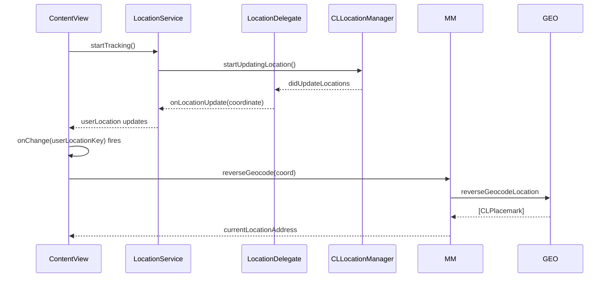
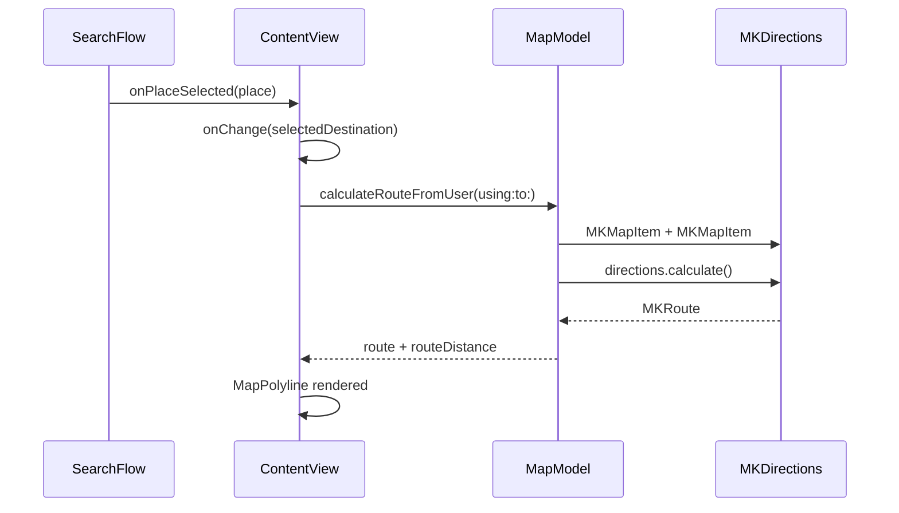

# MapKit Agent Guide

A guide for AI agents working on MapKit features in the `challenge-3-personal` Xcode project. This document is derived from the actual implementation and is meant to teach how to extend it correctly, not to document a generic MapKit reference.

The companion file `MapKit.md` enumerates every existing MapKit file in the codebase. Read it first for context, then return here for the rules.

---

## 1. Existing MapKit Surface

The project ships **two map screens** and **two map view models**, all backed by a single shared `LocationService`.

### 1.1 Map screens

| Screen | File | Purpose |
| --- | --- | --- |
| `ContentView` (home map) | `challenge-3-personal/Features/Home/Views/ContentView.swift` | The home map behind the hitch sheet. Shows the user, the destination pin, and the route. Snap-to-city is enforced on camera changes. |
| `MapDebugView` | `challenge-3-personal/Features/DebugMap/Views/MapDebugView.swift` | Developer-only map with manual controls: text-based `MKLocalSearch`, route A→B, route user→B, clear, center on user, and a live debug card. |

The home map is the only production surface. `MapDebugView` exists to exercise every MapKit capability in one place and is reached via a commented-out toolbar entry in `ContentView.swift:83-86`. Treat it as the **reference implementation** for any new MapKit feature.

### 1.2 View models

| View model | File | Owns |
| --- | --- | --- |
| `MapModel` | `challenge-3-personal/Core/Models/ViewModels/MapModel.swift` | Home map camera, route, geocoding, destination pin, address cache. |
| `MapDebugModel` | `challenge-3-personal/Features/DebugMap/Models/MapDebugModel.swift` | Debug-only camera, route, search, reverse-geocode, place name. Duplicates most of `MapModel`. |

Both models are `@MainActor @Observable final class` and both store a `MapCameraPosition` binding for the SwiftUI `Map` view.

### 1.3 Services

| Service | File | Owns |
| --- | --- | --- |
| `LocationService` | `challenge-3-personal/Core/Location/LocationService.swift` | The single `CLLocationManager`, authorization status, and ref-counted tracking. |
| `LocationDelegate` | same file | `NSObject` bridge that translates `CLLocationManagerDelegate` callbacks into closures. |

There is **no** `RouteService`, `SearchService`, or `GeocodingService`. Routing, search, and geocoding are called inline in the two view models. See §7 for how a future agent should factor these.

### 1.4 Models that touch MapKit

| Model | File | MapKit field |
| --- | --- | --- |
| `Place` | `challenge-3-personal/Core/Models/Data/Place.swift` | `var coordinate: CLLocationCoordinate2D?` |
| `User` | `challenge-3-personal/Core/Models/Data/User.swift` | `var location: CLLocationCoordinate2D?` (currently dead — see §8) |

Both are plain `struct` value types. Neither is a SwiftData `@Model`. Persisting them would require explicit SwiftData adoption; do not introduce `@Attribute(.unique)` without first reading the CloudKit constraints in the project agent guide.

---

## 2. Architecture Overview

### 2.1 Layered diagram

```mermaid
flowchart TB
    subgraph "View Layer"
        CV[ContentView\nhome map]
        MDV[MapDebugView]
        SF[SearchFlow\nin Features/Search]
    end
    subgraph "ViewModel Layer"
        MM[MapModel]
        MDM[MapDebugModel]
    end
    subgraph "Service Layer"
        LS[LocationService]
        LD[LocationDelegate]
        CLM[CLLocationManager]
        GEO[CLGeocoder]
        DIR[MKDirections]
        LSC[MKLocalSearch]
    end
    subgraph "Data Layer"
        MK[MKRoute / MKMapItem / MKCoordinateRegion]
        PLC[Place]
    end

    CV -->|@State| MM
    SF -->|@State| MM
    MDV -->|@State| MDM
    CV -->|@Environment AppStore| LS
    MDV -->|@Environment AppStore| LS
    SF -->|@Environment AppStore| LS

    MM -->|reads userLocation| LS
    MDM -->|reads userLocation| LS

    MM -->|reverseGeocodeAddressString| GEO
    MM -->|calculate| DIR
    MDM -->|reverseGeocodeLocation| GEO
    MDM -->|calculate| DIR
    MDM -->|start| LSC

    LS --> LD
    LD --> CLM

    MM -.publishes.-> MK
    MDM -.publishes.-> MK
    CV -->|Marker / MapPolyline| MK
    MDV -->|Marker / MapPolyline| MK
```

The view layer never talks to `CLGeocoder`, `MKDirections`, or `MKLocalSearch` directly. It only talks to its view model and reads from the shared `LocationService`.

### 2.2 State ownership rules

```mermaid
flowchart LR
    AS[AppStore\n@State in App] -->|owns| LS[LocationService]
    AS -->|owns| CS[ContactService]
    AS -->|owns| Places[recentPlaces: [Place]]
    CV -->|@State owns| MM[MapModel]
    SF -->|@State owns| MM2[MapModel\nper-sheet instance]
    MDV -->|@State owns| MDM[MapDebugModel]
```

- `AppStore` is the **single owner** of `LocationService` (`AppStore.swift:13`).
- `MapModel` instances are owned by their view via `@State` (`ContentView.swift:9`, `SearchFlow.swift:6`).
- `MapDebugModel` is owned by `MapDebugView` via `@State` (`MapDebugView.swift:10`).
- No map model is ever injected through the environment. The home view model lives in `ContentView`; the per-sheet reverse-geocoding instance lives in `SearchFlow`.

> **Important consequence:** `MapModel.routeDistance` is read by `RequestReceipt` for pricing. This works only because `ContentView` passes a `Binding<Double?>` for `routeDistance` to `SearchFlow` (`ContentView.swift:140`). A future agent must preserve this binding contract.

### 2.3 How location data flows



The pattern is identical in `MapDebugView`. The view never observes `LocationService.userLocation` directly with `.onChange`; it instead derives a `userLocationKey: String` and observes that, because `CLLocationCoordinate2D` is not `Equatable` in a way that SwiftUI's `onChange` can detect.

### 2.4 How routes flow



`MapModel` is the only place that constructs `MKDirections.Request` instances. The view never builds one.

### 2.5 How search flows (debug only)

`MapDebugModel.searchForDestination()` builds an `MKLocalSearch.Request` with `naturalLanguageQuery = searchQuery` and a 50 km × 50 km region centered on `pointA` (`MapDebugModel.swift:114-146`). The first result's coordinate replaces `pointB` and animates the camera.

There is **no production text search**. The home flow only shows a static `recentPlaces` list from `AppStore`.

---

## 3. Service Layer Conventions

### 3.1 `LocationService` is the only location authority

- File: `Core/Location/LocationService.swift`
- The class is `@MainActor @Observable final class`.
- It owns the `CLLocationManager` (private).
- It uses a `LocationDelegate: NSObject` bridge so the `@MainActor` model can receive delegate callbacks safely.
- `setupIfNeeded()` is idempotent — call it freely; it will not create a second manager.
- `startTracking()` / `stopTracking()` are ref-counted. Multiple views can call them without stopping each other's location updates.
- The first `startTracking()` call also drives the initial authorization flow if the status is `.notDetermined`.

**Rule:** A future agent that needs user location must read `LocationService.userLocation` and call `startTracking()` / `stopTracking()`. Do not create a second `CLLocationManager`.

### 3.2 No service currently owns routing, search, or geocoding

This is technical debt, but it is the current state. Both `MapModel` and `MapDebugModel` instantiate their own `CLGeocoder`. The route-calculation code is byte-identical in both view models (`MapModel.swift:96-123` and `MapDebugModel.swift:59-86`).

**Rule (recommended):** When you next touch routing, extract a `RouteService` and a `GeocodingService` in `Core/Location/`. The view models should call into them. See §7.2 for the recommended shape.

### 3.3 Public API surface to preserve

| Type | Member | Notes |
| --- | --- | --- |
| `LocationService` | `var userLocation: CLLocationCoordinate2D?` | The single coordinate of truth. |
| `LocationService` | `var authorizationStatus: CLAuthorizationStatus` | Mirror of `CLLocationManager.authorizationStatus`. |
| `LocationService` | `func setupIfNeeded()` | Idempotent. |
| `LocationService` | `func requestAuthorization()` | Only fires if status is `.notDetermined`. |
| `LocationService` | `func startTracking()` / `func stopTracking()` | Ref-counted. |
| `MapModel` | `var position: MapCameraPosition` | Bound to `Map(position:)` in the view. |
| `MapModel` | `var route: MKRoute?` | The latest computed route. |
| `MapModel` | `var routeDistance: Double?` | Bound through to `RequestReceipt` for pricing. |
| `MapModel` | `func reverseGeocode(_:)` | Coordinate → address string. |
| `MapModel` | `func calculateRouteFromUser(using:to:)` | User → destination routing. |
| `MapModel` | `func geocodeAddress(_:) async -> CLLocationCoordinate2D?` | Address → coordinate. |
| `MapModel` | `func clearRoute()` / `func resetDestination()` | Sheet-cancellation hooks. |
| `MapDebugModel` | `func searchForDestination()` | `MKLocalSearch` entry point (debug only). |
| `MapDebugModel` | `func calculateRouteAB()` / `func calculateRouteFromUser(using:)` | Same shape as `MapModel` plus A→B convenience. |
| `MapDebugModel` | `func centerOnUser(using:)` | Animated camera recenter. |

Anything not on this list is internal to the file and may be refactored freely.

---

## 4. View Layer Conventions

### 4.1 Existing screens and their responsibilities

- **`ContentView`** is the home root. It owns the `Map(position: $model.position)` and the bottom sheet. It also starts location tracking on appear and starts the contact permission request in a `Task`. The `.onMapCameraChange` block enforces snap-to-city (`ContentView.swift:50-57`).
- **`MapDebugView`** is a self-contained developer screen. It manages its own tracking lifecycle via `startTracking()` / `stopTracking()` in `onAppear` / `onDisappear` (`MapDebugView.swift:112-117`).
- **`SearchFlow`** hosts the destination-pick → friend-pick → receipt → sent flow. It instantiates its own `MapModel` (`SearchFlow.swift:6`) for the sole purpose of reverse-geocoding the user while the sheet is open. The home `MapModel` is untouched.
- **`HitchSheet`, `RequestSearchLocation`, `RequestPickFriend`, `RequestReceipt`, `RequestSentSheet`** — these are sheet content, not map screens, but they read `currentLocationAddress` (a `MapModel` property) for display.

### 4.2 Reusable map UI patterns

The codebase does **not** yet have a `MapComponents/` folder. The following patterns are repeated inline and should be extracted the next time a second screen needs them:

1. **The route polyline + color** (`ContentView.swift:21-23, 40-43` and `MapDebugView.swift:19-21, 33-36`):

   ```swift
   if let route = model.route {
       MapPolyline(route)
           .stroke(routeColor, lineWidth: 8)
   }
   ```

   The `routeColor` computed property exists in both views verbatim. Future refactor target: a `MapRouteOverlay` view.

2. **The user-location-key derivation**:

   ```swift
   private var userLocationKey: String {
       guard let loc = store.locationService.userLocation else { return "nil" }
       return "\(loc.latitude),\(loc.longitude)"
   }
   ```

   Exists in `ContentView.swift:25-28`, `SearchFlow.swift:13-16`, and `MapDebugView.swift:14-17`. Future refactor target: a `EquatableCoordinate` wrapper or a computed property on `LocationService`.

3. **Annotation composition inside `Map { … }`** — see §6 for the pattern.

### 4.3 Annotation components

There is no dedicated annotation component file. Every map screen writes its own `Map { ... }` block with `Marker` and `UserAnnotation` directly. This is acceptable for now (one annotation type, one pin per screen), but:

- If a future feature needs more than one user-style pin, factor a `UserMarker` and a `DestinationMarker` view.
- If a future feature needs custom marker art (icons beyond the SF Symbol default), use the `Annotation { ... }` container with custom views. The existing `Marker` calls do **not** need to change.

### 4.4 Search components

There is no production search component. The debug `MapDebugView` is the only place that renders a `TextField`-driven search bar (`MapDebugView.swift:49-75`). The home `HitchSheet` shows a `Searchbar` (`Features/Home/Components/Sheet/Searchbar.swift`) which is currently a styled `HStack` that fires `onSearchTapped` — the actual `MKLocalSearch` is not wired up here.

---

## 5. State Management Conventions

### 5.1 Observation framework

- **Every model is `@MainActor @Observable final class`.** This is a hard project rule from `agents.md` and applies to map models too.
- View models are owned via `@State` in their view.
- The `AppStore` (which owns services) is read via `@Environment(AppStore.self)`.
- `@Bindable` is used implicitly through the `Map(position: $model.position)` binding, which is a `@State`-owned model. The SwiftUI macro generates the bindings.

### 5.2 Environment dependencies

Only one `Environment` value flows through the app: `AppStore`. A future map view should never reach into `AppStore` for anything other than `locationService`. Anything else (mock data, rides, etc.) should be passed as a parameter or read from its own model.

### 5.3 Dependency injection

`AppStore.init(...)` accepts optional `locationService: LocationService?` (`AppStore.swift:26`), so previews and tests can inject a fake. The default initializer constructs a real `LocationService`. Any future service that you build should follow the same pattern.

`MapModel.calculateRouteFromUser(using locationService: LocationService, ...)` takes the location service as a method parameter rather than holding a reference (`MapModel.swift:80`). This keeps the view model stateless beyond its `@Observable` properties and makes it trivially mockable in tests.

### 5.4 Concurrency

- All public map model methods that do work are `async` (`reverseGeocode`, `calculateRouteFromUser`, `geocodeAddress`, `searchForDestination`, `calculateRouteAB`).
- The view layer kicks off the work with `Task { await ... }` inside button actions and `onChange` handlers.
- `LocationService` itself is synchronous; the `@MainActor` closure it dispatches from the delegate is wrapped in `Task { @MainActor in ... }` (`LocationService.swift:17-19, 22-34`).
- `CLGeocoder` and `MKDirections` already have `async` APIs; we always use them.
- `CLGeocoder` is created per-call in `MapModel` and `MapDebugModel` — there is no shared geocoder. This is fine because `CLGeocoder` is documented as a single-flight queue internally.

### 5.5 Caching and side-channel state

`MapModel.currentLocationAddress` (`MapModel.swift:12-15`) is a computed property that reads from and writes to `UserDefaults` under the key `"cachedLocationAddress"`. This is a known issue flagged in `MapKit.md` and the code review: the Observation framework cannot see writes that go through `UserDefaults`, so views that read this property do not update reactively.

**Rule for new code:** do not back an `@Observable` property with `UserDefaults` (or `@AppStorage`). Either store the value as a normal `@Observable` field, or wrap the UserDefaults write in an explicit observation mutation if persistence is required.

---

## 6. Annotation and Overlay Patterns

### 6.1 The home map's annotation set

`ContentView.swift:33-44`:

```swift
Map(position: $model.position) {
    UserAnnotation()
    if (model.destinationName != nil) {
        Marker(model.destinationName ?? "Point B", coordinate: model.pointB)
    }
    if let route = model.route {
        MapPolyline(route)
            .stroke(routeColor, lineWidth: 8)
    }
}
.mapStyle(.standard)
.mapControls {
    MapUserLocationButton()
    MapCompass()
}
```

The pattern is: optional `Marker` only when there is a destination, optional `MapPolyline` only when there is a route, and a constant `UserAnnotation()`. The destination marker label is the destination name, falling back to `"Point B"`.

### 6.2 The debug map's annotation set

`MapDebugView.swift:25-44` always renders `pointA`, `pointB` (or the search result), and a redundant `Marker("You", …)` alongside `UserAnnotation()`. This redundancy is intentional for debugging.

### 6.3 Stroke color

Both views compute `routeColor` from `\.colorScheme` (`ContentView.swift:21-23`, `MapDebugView.swift:19-21`). The values are identical. When extracting a `MapRouteOverlay`, the color logic should move with it.

### 6.4 Map style and controls

`.mapStyle(.standard)` and `.mapControls { MapUserLocationButton(); MapCompass() }` are present in both views. A future agent should keep both for consistency, or upgrade both to the same richer control set (e.g. adding `MapScaleView`).

### 6.5 Camera positioning

The home map's initial `MapCameraPosition` is set in `MapModel.init` and `MapModel.snapToCity` to a `.region(MKCoordinateRegion(center: cityCenter, span: citySpan))`. The `cityCenter` and `citySpan` are hard-coded to Jakarta.

The debug map's initial position is set in `MapDebugModel.init` to a smaller span (0.05° vs 0.15°) centered on `pointA`.

**Rule:** any new screen that needs a city-level map should re-use the `MapModel.cityCenter` / `citySpan` constants, not redefine them.

---

## 7. Feature Development Guidelines

### 7.1 Adding a new map screen

1. Create the screen under `Features/<FeatureName>/Views/<ScreenName>View.swift`.
2. Create the view model under `Features/<FeatureName>/Models/<ScreenName>Model.swift` as `@MainActor @Observable final class`.
3. Inject `AppStore` via `@Environment(AppStore.self)` and read `store.locationService` for any location data.
4. Call `store.locationService.startTracking()` in `.onAppear` and `stopTracking()` in `.onDisappear`.
5. Re-use `MapModel.cityCenter` / `citySpan` for the initial `MapCameraPosition`.
6. Apply `.mapStyle(.standard)` and `.mapControls { MapUserLocationButton(); MapCompass() }` to match existing screens.
7. Add a route entry to `ContentView` if the screen should be reachable from the home toolbar. The current pattern is `path.append("debugmap")` and a corresponding `if value == "debugmap" { MapDebugView() }` branch in the `navigationDestination(for: String.self)`. If you have read the code-review findings, prefer an enum over `String` for new routes.

**Do not** create a new `CLLocationManager` or a new `LocationService` instance — always go through the one owned by `AppStore`.

### 7.2 Adding routing to a new screen

1. Add the route-related fields to your view model: `var route: MKRoute?`, `var routeDistance: Double?`, `var isCalculatingRoute: Bool`.
2. Add a `func calculateRoute(from:to:) async` that wraps the `MKMapItem` / `MKDirections` pattern used in `MapModel.calculateRoute(from:to:)` (`MapModel.swift:96-123`).
3. If the screen is meant to mirror the home map's behavior, pass `LocationService` as a method parameter (not as a stored property) — this matches the existing convention.
4. Render the route with `MapPolyline(route).stroke(routeColor, lineWidth: 8)`.
5. Consider whether the screen should re-use the existing `routeColor` logic. If so, extract a small `MapRouteOverlay` view and let both screens use it.

**Recommended refactor before adding more screens:** extract a `RouteService` in `Core/Location/`:

```swift
@MainActor
protocol RouteProviding {
    func route(from: CLLocationCoordinate2D, to: CLLocationCoordinate2D, transportType: MKDirectionsTransportType) async -> MKRoute?
}
```

`MapModel` and `MapDebugModel` would then call `routeService.route(from: userLocation, to: dest, transportType: .automobile)` instead of duplicating the `MKDirections.calculate()` block.

### 7.3 Adding search to a new screen

There is currently no production search. The debug screen is the only example. To add a real search:

1. Add `var searchQuery: String` and `var isSearching: Bool` and `var results: [MKMapItem]` (or a project-owned model) to the view model.
2. Add `func search(_ query: String) async` that wraps `MKLocalSearch.Request` with `naturalLanguageQuery` and a `region` derived from the current camera (or from the user location, with a fallback to the city center).
3. Render the results in a `List` or a sheet — see `RequestPickFriend.swift:71-85` for the existing list pattern.
4. On selection, set the destination in the model and call `calculateRouteFromUser(using:to:)`.

**Recommended refactor:** extract a `SearchService` in `Core/Location/` so the model can call `searchService.search(query:in:)` without holding an `MKLocalSearch` reference. Use the current `MKLocalSearch` API (not the legacy `MKLocalSearchRequest`).

### 7.4 Adding custom annotations

1. Decide between `Marker` (system-styled pin) and `Annotation { … }` (custom SwiftUI view content).
2. If using `Marker`, set the label to the human-readable name. Never use a non-ASCII or numeric label.
3. If using `Annotation`, render the custom view inside the closure and apply the appropriate `accessibilityLabel`.
4. Always gate expensive annotations behind an `if let` or `if` so the `Map { … }` builder stays cheap on rebuilds.
5. For a custom user pin (instead of the default `UserAnnotation()`), call `Annotation("You", coordinate: coord) { CustomPin() }` and use the project's asset colors (`.greenBrand`, `.ink`, etc.).

### 7.5 Tracking the user in a new feature

- If the feature is a long-lived screen (e.g. a navigation HUD), call `startTracking()` in `onAppear` and `stopTracking()` in `onDisappear`, matching `ContentView.swift:154-160` and `MapDebugView.swift:112-117`.
- If the feature is a sheet, do **not** call `startTracking()` again — the parent `ContentView` already holds the refcount open while the sheet is presented. Reading `store.locationService.userLocation` is enough.
- Do not poll `CLLocationManager` manually. The service exposes a live coordinate via `userLocation`.

### 7.6 Adding "nearby places" functionality

The current codebase has no nearby-search surface. To add one:

1. Build an `MKLocalSearch.Request` with `region = MKCoordinateRegion(center: userLocation, latitudinalMeters: 5000, longitudinalMeters: 5000)`.
2. Add a `func nearbyPlaces(category: MKPointOfInterestCategory?) async` to a new `SearchService` (or directly to the view model if you are not yet extracting the service).
3. Map each `MKMapItem` to the project's `Place` model. Re-use the existing `Place` initializer — do not invent a new type.
4. Render the result list in a sheet, with the same `List` + `LocationCard` pattern used in `RequestSearchLocation.swift:46-57`.
5. Treat the list as a transient list — do not persist results to `AppStore.recentPlaces`. That list is meant for the user's own selected destinations.

### 7.7 Reusing existing services and models

- **Always** reuse `LocationService` for any location work.
- **Always** reuse `Place` for any destination representation. The `coordinate` field is optional on purpose — a `Place` may exist before it has been geocoded.
- **Never** introduce a second `CLGeocoder` field at the file level. `CLGeocoder` is fine to construct per-call.
- **Never** use `UserDefaults` to back an `@Observable` property (see §5.5).
- **Never** import `import _LocationEssentials` or any other private Apple module. `SearchFlow.swift:2` has a stray `internal import _LocationEssentials` that should be removed; do not propagate that pattern.

---

## 8. Common Pitfalls and Areas of Caution

### 8.1 Existing technical debt

- **Duplicated route logic** between `MapModel.calculateRoute(from:to:)` and `MapDebugModel.calculateRoute(from:to:)`. The two implementations are byte-identical. Any future agent adding a third map screen will create a third copy. Extract `RouteService` first.
- **Duplicated search code** is not yet a problem (only one screen uses `MKLocalSearch`), but it will be the moment production search is added. Plan for `SearchService`.
- **Duplicated reverse-geocoder logic** — `MapModel.reverseGeocode(_:)` and `MapDebugModel.reverseGeocodeUserLocation(using:)` both build the same comma-joined address. Extract to a free function or a `GeocodingService` method.
- **`UserDefaults`-backed `@Observable` property** at `MapModel.swift:12-15` is silently buggy. Future work should fix it; do not use it as a template for new code.
- **Stringly-typed navigation** in `ContentView.swift:90-100` uses `String` literals as route keys. If you need to add a new map route, add a new `if value == "…" { … }` branch and a corresponding `path.append("…")` call site. Prefer an enum.
- **Hard-coded `pointA` and `pointB`** in both view models. These are debug-friendly placeholders, not real destinations. If you need a real default destination, add it to `AppStore` and read from there.
- **`MapModel.userLocation` is dead** — declared at `MapModel.swift:11`, never written. Treat any read of it as a bug.
- **`User.location` is dead** — declared at `User.swift:11`, never written. If a future feature needs a user's location, add a separate model field (e.g. `lastSeenLocation`) and have `LocationService` populate it via a callback.

### 8.2 Architectural constraints

- **iOS 26+ is the deployment target.** Use the modern `Map` SwiftUI integration, the modern `Map(position:)` binding, the modern `MapPolyline`, and `MapContentBuilder` annotations. Do not fall back to `MKMapView` via `UIViewRepresentable` unless the user explicitly requests UIKit.
- **No third-party frameworks** are allowed. Do not pull in Mapbox, Google Maps, or any MapKit wrapper.
- **No SwiftData yet.** `Place` and `Ride` are plain structs. If you add persistence, you must also decide whether to migrate to SwiftData and update the `MapModel` / `AppStore` to read from a `ModelContext`.
- **Single `CLLocationManager`.** All screens share `LocationService`. If you ever need different accuracy or background updates, add a new method on `LocationService` rather than instantiating a second manager.
- **Snap-to-city on the home map** (`ContentView.swift:50-57`) is intentional. Do not remove it without coordinating with the product team — it is the project's chosen way to keep the user on the Jakarta city view.

### 8.3 Areas to modify only with caution

- `LocationService.swift` — touches CoreLocation authorization flow. Any change here affects every map screen and the home screen. Test on a real device.
- `MapModel.calculateRoute(from:to:)` — used by `ContentView` indirectly through `calculateRouteFromUser(using:to:)`. Behavior changes here will silently affect the price shown in `RequestReceipt`.
- `MapModel.pointB` — written by both `MapModel` (`MapModel.swift:20, 83, 132`) and `MapDebugModel` (`MapDebugModel.swift:24, 132`). The two are intentionally separate instances, but the constant is the same. If you add a third "default destination" use case, move it to `AppStore` and read it from there instead of re-initializing the coordinate.
- `ContentView.onMapCameraChange` — the snap-to-city logic. Removing or weakening this will let the user pan far away from Jakarta. Confirm with the team before changing.
- `RequestReceipt`'s price formula — depends on `MapModel.routeDistance` in meters. Any change to the units or calculation in `MapModel` will silently change every receipt.

### 8.4 Things future agents commonly get wrong

- **Treating `Map(position:)` as a write-only binding.** The `$model.position` is a binding — reads from the binding (e.g. inside `onMapCameraChange`) reflect the current camera. Do not also store a separate `region` field.
- **Calling `startTracking()` in a sheet.** Sheets that appear on top of the home map already share the home map's tracking session. Calling `startTracking()` again will increment the refcount but the redundant call is harmless. The bug is the *opposite*: forgetting to call `stopTracking()` in `onDisappear` on a long-lived screen will keep the GPS running.
- **Reading `LocationService.authorizationStatus` only once.** It is a published property on an `@Observable` service. Subscribe to it through Observation, not through a one-shot read.
- **Using `Map` content with side effects.** The `Map { … }` builder runs frequently. Do not perform any non-trivial work inside it.
- **Mixing `Map(position:)` and `MapCameraPosition.region(...)` with manual `region` setters.** Pick one. The project uses the `Map(position:)` binding throughout; do not introduce a `region: MKCoordinateRegion` state.

---

## 9. Worked Examples

### 9.1 Add a new map screen (skeleton)

`Features/Nearby/Views/NearbyView.swift`:

```swift
import SwiftUI
import MapKit

struct NearbyView: View {
    @State private var model = NearbyModel()
    @Environment(AppStore.self) private var store

    var body: some View {
        Map(position: $model.position) {
            UserAnnotation()
            ForEach(model.markers) { marker in
                Marker(marker.title, coordinate: marker.coordinate)
            }
        }
        .mapStyle(.standard)
        .mapControls {
            MapUserLocationButton()
            MapCompass()
        }
        .onAppear { store.locationService.startTracking() }
        .onDisappear { store.locationService.stopTracking() }
        .task(id: store.locationService.userLocationKey) {
            guard let coord = store.locationService.userLocation else { return }
            await model.refresh(around: coord)
        }
    }
}
```

`Features/Nearby/Models/NearbyModel.swift`:

```swift
import MapKit
import SwiftUI

@MainActor
@Observable
final class NearbyModel {
    var position: MapCameraPosition
    var markers: [Place] = []
    var isLoading = false

    init() {
        position = .region(
            MKCoordinateRegion(
                center: CLLocationCoordinate2D(latitude: -6.2088, longitude: 106.8456),
                span: MKCoordinateSpan(latitudeDelta: 0.15, longitudeDelta: 0.15)
            )
        )
    }

    func refresh(around coordinate: CLLocationCoordinate2D) async {
        // Use a SearchService once extracted.
    }
}

private extension LocationService {
    /// A drop-in for the stringified key used by .task(id:).
    var userLocationKey: String? {
        guard let loc = userLocation else { return nil }
        return "\(loc.latitude),\(loc.longitude)"
    }
}
```

Wire the route in `ContentView.swift` by adding a new `if value == "nearby" { NearbyView() }` branch (or, after the navigation refactor, a new `case .nearby` in an enum).

### 9.2 Add a search field to the home flow

1. Add a `searchQuery: String` and a `results: [MKMapItem]` to a new `MapSearchModel` owned by the home map (or co-locate them in `MapModel` if you are willing to grow it).
2. Add a `func search() async` method:

   ```swift
   func search() async {
       let request = MKLocalSearch.Request()
       request.naturalLanguageQuery = searchQuery
       request.region = MKCoordinateRegion(
           center: .init(latitude: -6.2088, longitude: 106.8456),
           latitudinalMeters: 50_000,
           longitudinalMeters: 50_000
       )
       do {
           let response = try await MKLocalSearch(request: request).start()
           results = response.mapItems
       } catch {
           results = []
       }
   }
   ```

3. Render the results in a `List` and convert each `MKMapItem` to the project's `Place` model:

   ```swift
   let place = Place(
       name: item.name ?? "Unknown",
       address: item.placemark.title ?? "",
       coordinate: item.placemark.coordinate
   )
   ```

4. On tap, call the existing `MapModel.calculateRouteFromUser(using:to:)` — do not duplicate the routing logic.

### 9.3 Create a new route (route only, no UI change)

Inside any view model that needs to recompute the route:

```swift
func recomputeRoute(to destination: CLLocationCoordinate2D) async {
    await calculateRouteFromUser(using: locationService, to: destination)
}
```

The view calls this in response to a destination change. The view never constructs an `MKMapItem` or calls `MKDirections` directly.

### 9.4 Display a new annotation type

To show, for example, a custom restaurant pin:

```swift
Map(position: $model.position) {
    UserAnnotation()
    ForEach(model.restaurants) { restaurant in
        Annotation(restaurant.name, coordinate: restaurant.coordinate) {
            Image(systemName: "fork.knife.circle.fill")
                .font(.title)
                .foregroundStyle(.greenBrand)
                .background(.background, in: .circle)
                .accessibilityLabel(Text(restaurant.name))
        }
    }
}
```

Use `Annotation { … }` whenever the visual differs from the system marker. Otherwise, prefer `Marker(_:coordinate:)`.

### 9.5 Wire a new screen into the home navigation

Today, the home uses `path.append("…")` strings. To add a new screen:

1. Add an `if value == "nearby" { NearbyView() }` branch to the `navigationDestination(for: String.self)` block in `ContentView.swift`.
2. Add a button somewhere — e.g. inside the existing toolbar `HStack`:

   ```swift
   Button("Nearby", systemImage: "magnifyingglass.circle", action: {
       path.append("nearby")
   })
   ```

3. If the screen is reached from a context where `showHitchSheet` should close, set `showHitchSheet = false` before the append, or use the `onChange(of: path.isEmpty)` already in place.

The code review flagged `String`-keyed navigation as fragile. When you have time, refactor to an enum (`enum HomeRoute: Hashable { case history, activity, notification, debugMap, nearby }`) and a single `navigationDestination(for: HomeRoute.self)` block.

---

## 10. Recommended Future Refactors (Prioritized)

1. **Extract `RouteService`** in `Core/Location/`. Replace the two byte-identical `calculateRoute(from:to:)` bodies with a single call. The two view models will shrink and gain testability.
2. **Extract `GeocodingService`** in `Core/Location/`. Move `reverseGeocodeLocation` and `geocodeAddressString` into one place. Both view models then share a single `CLGeocoder` lifecycle.
3. **Extract `SearchService`** in `Core/Location/`. Move `MKLocalSearch` usage out of `MapDebugModel` so production search can plug in.
4. **Fix `MapModel.currentLocationAddress`** to be a normal `@Observable` stored property. If persistence is required, use `UserDefaults` as a load-on-init source, not as the backing store.
5. **Introduce a `MapRouteOverlay` view** with the `routeColor` logic and the `MapPolyline(...).stroke(...)` block. Replace the duplicated `routeColor` computed properties in `ContentView` and `MapDebugView`.
6. **Introduce a `MapConstants` enum** in `Core/Location/` for `cityCenter`, `citySpan`, and the debug `regionSpan`. Stop hard-coding coordinates in two files.
7. **Refactor the stringly-typed `HomeRoute`** into a `Hashable` enum. The current `ContentView.navigationDestination(for: String.self)` is fragile.
8. **Remove dead code** — `MapModel.userLocation`, `User.location`. The maps and contacts documentation already flag these; future cleanup is welcome.
9. **Remove `internal import _LocationEssentials`** in `SearchFlow.swift:2` if it is unused. The private Apple module import is unsafe and should not be in shipping code.
10. **Surface `LocationService` errors** — the silent `didFailWithError` empty body in `LocationDelegate` should at least publish an `Error?` for the view layer to render.
