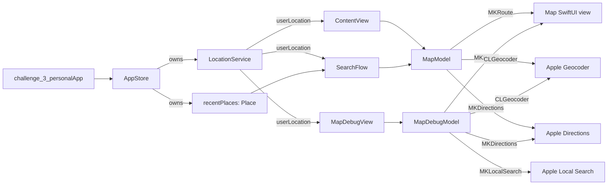
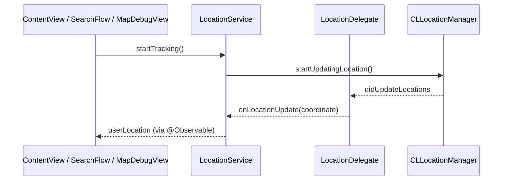
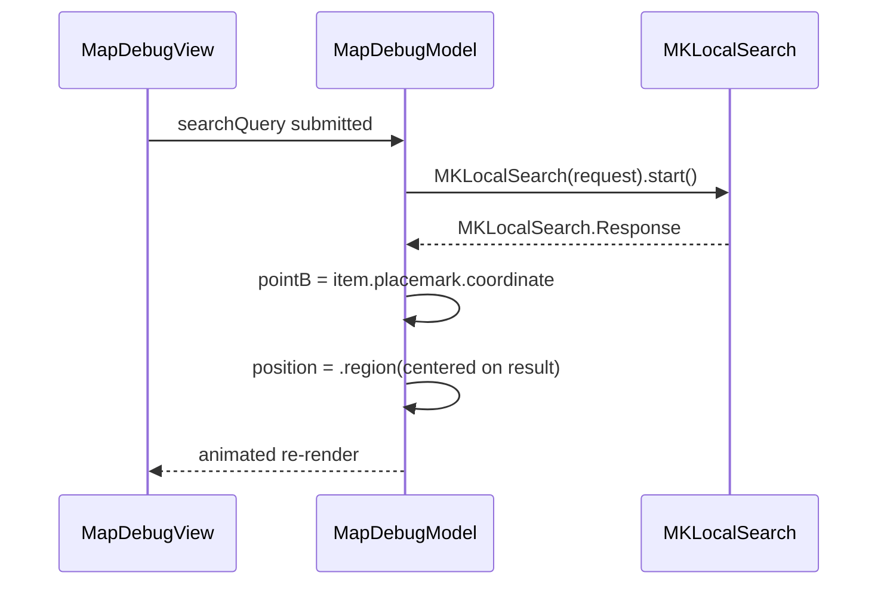
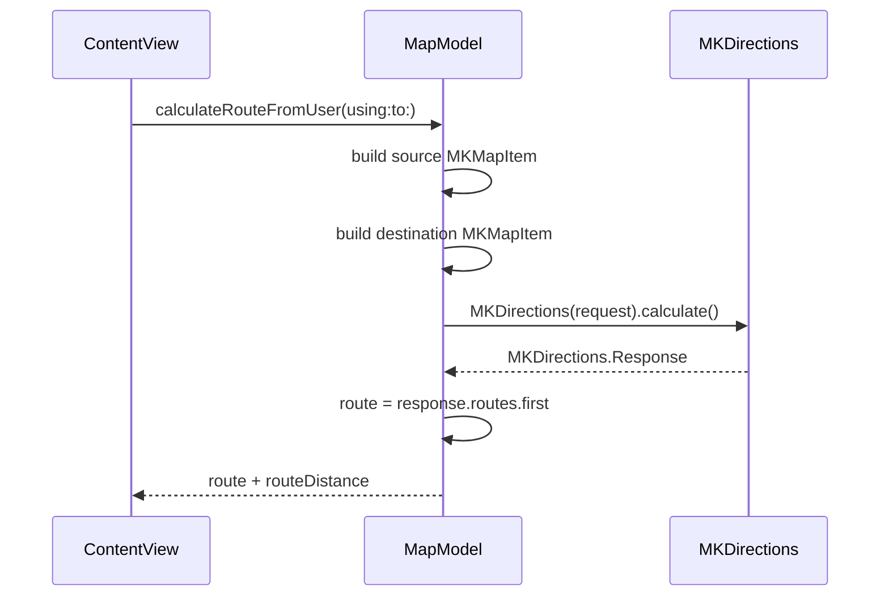
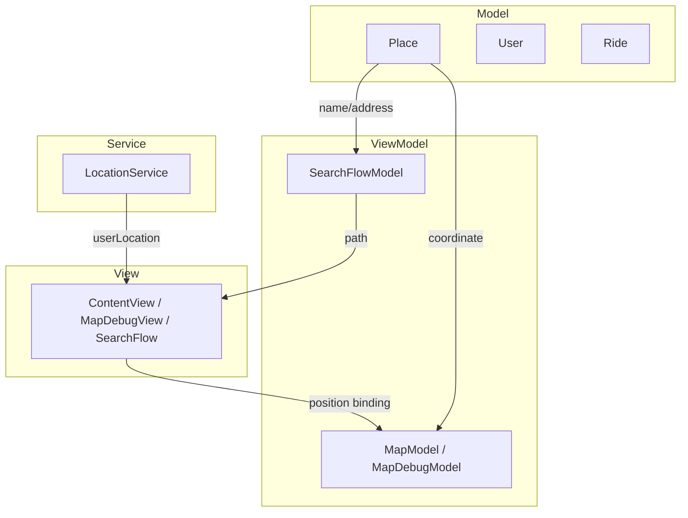

# MapKit Documentation

Comprehensive documentation of every MapKit-related implementation in the `challenge-3-personal` Xcode project. This document is based strictly on the code that currently exists in the repository.

---

## 1. Overview

### 1.1 Purpose of MapKit in this project

MapKit is used as a lightweight geographic layer for a ride-hitching app called **Hitch**. The map is **not the centerpiece** of the UI — it sits as a background canvas while users interact with a bottom sheet for searching destinations, picking friends, and sending ride requests. MapKit's role is therefore narrower than a typical maps app:

- Show the user's current location on a standard map.
- Display a destination pin once a user selects a place.
- Draw a driving route between the user and that destination.
- Reverse-geocode the user's coordinate into a human-readable address.
- Provide a debug canvas for manual testing of search, routing, and location updates.

### 1.2 High-level map flow

The map is mounted at the root of the app inside `ContentView` (`Features/Home/Views/ContentView.swift:33`). A single `Map` SwiftUI view backs the home screen, controlled by a `MapModel` (`Core/Models/ViewModels/MapModel.swift`). The user can also navigate to a `MapDebugView` (`Features/DebugMap/Views/MapDebugView.swift`) which has its own dedicated `MapDebugModel` (`Features/DebugMap/Models/MapDebugModel.swift`).

The app follows this flow at runtime:

1. `challenge_3_personalApp` creates an `AppStore.mock()` and injects it as a SwiftUI environment.
2. `ContentView.onAppear` calls `store.locationService.startTracking()` to begin receiving CoreLocation updates.
3. As the user's location changes, `LocationService` updates `userLocation`, which is then propagated into `MapModel.reverseGeocode(_:)` to obtain an address string.
4. When the user selects a destination in the search flow, `ContentView` triggers `MapModel.calculateRouteFromUser(using:to:)` which uses `MKDirections` to compute a driving route.
5. The route polyline and destination marker are then rendered on the `Map` view.

### 1.3 Integration with other modules



Key touchpoints:

- `AppStore` (`Core/Models/ViewModels/AppStore.swift:13`) owns the single `LocationService` instance.
- `MapModel.currentLocationAddress` is consumed by `SearchFlow` to display "From: …" in receipts.
- `MapModel.routeDistance` is read by `RequestReceipt` to compute prices.
- `SearchFlow` instantiates its own `MapModel` for reverse-geocoding the user while the search sheet is open.

---

## 2. Map Features

### 2.1 Map display

- **Implementation:** SwiftUI's `Map` view from MapKit's SwiftUI integration.
- **Locations:**
  - `Features/Home/Views/ContentView.swift:33` — `Map(position: $model.position)`
  - `Features/DebugMap/Views/MapDebugView.swift:25` — `Map(position: $model.position, interactionModes: .all)`
- **Map style:** `.mapStyle(.standard)` in both views.
- **Map controls:** `MapUserLocationButton()` and `MapCompass()` are added via `.mapControls { … }` in both views.

### 2.2 User location tracking

- **Service:** `LocationService` (`Core/Location/LocationService.swift`).
- **Capabilities:**
  - Lazily creates a `CLLocationManager` with `desiredAccuracy = kCLLocationAccuracyHundredMeters` and `distanceFilter = 25`.
  - Requests `requestWhenInUseAuthorization` when authorization is undetermined.
  - Uses a reference-counted `startTracking` / `stopTracking` API so multiple views can subscribe without stopping each other.
- **Tracking start sites:**
  - `ContentView.onAppear` (`ContentView.swift:155`)
  - `SearchFlow.onAppear` (`SearchFlow.swift:74`)
  - `MapDebugView.onAppear` (`MapDebugView.swift:113`)

### 2.3 Search functionality

- **Implementation:** `MKLocalSearch` (Apple's local search API) is used in `MapDebugModel.searchForDestination()` (`MapDebugModel.swift:114`).
- **Search region:** Centered on `pointA` (Jakarta), bounded by a 50 km × 50 km box.
- **UI surface:** The search bar is inside `MapDebugView` (a debug-only screen) and submits on `onSubmit` (`MapDebugView.swift:54`).
- **No production search UI is wired up to `MKLocalSearch`.** The `RequestSearchLocation` view shows a static list of `recentPlaces` only.

### 2.4 Route generation

- **Implementation:** `MKDirections` is invoked in both `MapModel.calculateRoute(from:to:)` (`MapModel.swift:96`) and `MapDebugModel.calculateRoute(from:to:)` (`MapDebugModel.swift:59`).
- **Transport type:** `.automobile`.
- **Wrapping:** Each coordinate is wrapped in an `MKMapItem` with no address; `MKDirections.calculate()` is awaited to obtain `MKRoute`.
- **Public entry points:**
  - `MapModel.calculateRouteAB()` — fixed A→B route using hard-coded `pointA` and `pointB`.
  - `MapModel.calculateRouteFromUser(using:to:)` — from the live user location to either an explicit destination or `pointB`.
  - `MapDebugModel.calculateRouteAB()` and `MapDebugModel.calculateRouteFromUser(using:)` — same logic for the debug screen.

### 2.5 Directions and navigation

- **Implemented:** Route calculation (distance + polyline) only.
- **Not implemented:** Turn-by-turn navigation, voice guidance, route step display, `MKRoute.steps` consumption, ETA, or live re-routing on user movement. The current code never reads `MKRoute.steps`, only `.routes.first` and `.distance`.

### 2.6 Annotations / markers

Custom `Marker` views are placed on the map:

- `ContentView.swift:37` — `Marker(model.destinationName ?? "Point B", coordinate: model.pointB)`. Only displayed when `destinationName` is non-nil.
- `MapDebugView.swift:27` — `Marker("You", coordinate: userLocation)` (redundant alongside `UserAnnotation()` below).
- `MapDebugView.swift:30` — `Marker("Point A", coordinate: model.pointA)`.
- `MapDebugView.swift:31` — `Marker(model.searchResultName ?? "Point B", coordinate: model.pointB)`.

`UserAnnotation()` (Apple-provided blue dot) is rendered in both maps at `ContentView.swift:34` and `MapDebugView.swift:38`.

### 2.7 Custom map pins

- **Not implemented.** No custom `Annotation` views or `MKAnnotationView` subclasses are used. All pins are default `Marker` views and `UserAnnotation`.

### 2.8 Camera positioning

- The `Map(position:)` SwiftUI binding is driven by `MapCameraPosition` values inside each model.
- `MapModel` initializes `position` to a `.region(MKCoordinateRegion(center: cityCenter, span: citySpan))` (Jakarta).
- `MapDebugModel` initializes `position` to a `.region(MKCoordinateRegion(center: pointA, span: regionSpan))`.
- `MapModel.snapToCity()` (`MapModel.swift:34`) animates the camera back to the Jakarta center with `.smooth(duration: 0.5)`.
- `MapDebugModel.centerOnUser(using:)` (`MapDebugModel.swift:38`) animates the camera to the user's coordinate.
- `MapDebugModel.searchForDestination()` (`MapDebugModel.swift:134`) animates the camera to the first search result.

### 2.9 Region management

- `ContentView` attaches `.onMapCameraChange { context in … }` (`ContentView.swift:50`) which reads the new `MKCoordinateRegion` center. If the camera strays more than 0.2 degrees in latitude or longitude from the Jakarta reference, it triggers `model.snapToCity()` to bring the user back. This is a hard constraint, not user-configurable.

### 2.10 Geofencing

- **Not implemented.** No usage of `CLCircularRegion`, `CLLocationManager.startMonitoring(for:)`, or region monitoring delegates was found in the codebase.

### 2.11 Other MapKit capabilities

- **Reverse geocoding** via `CLGeocoder` in both `MapModel.reverseGeocode(_:)` and `MapDebugModel.reverseGeocodeUserLocation(using:)`.
- **Forward geocoding** via `CLGeocoder.geocodeAddressString(_:)` in `MapModel.geocodeAddress(_:)`. This is invoked from `ContentView.onChange(of: selectedDestination)` (`ContentView.swift:180`) when a `Place` has no embedded coordinate.
- **MKLocalSearch** is used only in the debug screen.
- **Snap-to-region** behavior in `ContentView`.

---

## 3. Code Structure

### 3.1 `Core/Location/LocationService.swift`

- **Responsibility:** Wraps `CLLocationManager` and exposes a SwiftUI-friendly `@Observable` interface.
- **Types:**
  - `final class LocationService: @MainActor @Observable` — primary API.
  - `final class LocationDelegate: NSObject, CLLocationManagerDelegate` — internal delegate bridge.
- **Key members:**
  - `var userLocation: CLLocationCoordinate2D?` — last known coordinate.
  - `var authorizationStatus: CLAuthorizationStatus` — current permission state.
  - `private var trackingCount: Int` — ref-count for `startTracking` / `stopTracking`.
  - `setupIfNeeded()` — creates the manager exactly once.
  - `requestAuthorization()` — calls `requestWhenInUseAuthorization()` if status is `.notDetermined`.
  - `startTracking()` / `stopTracking()` — increment/decrement ref count and toggle `startUpdatingLocation()`.
- **Delegate callbacks:**
  - `locationManager(_:didUpdateLocations:)` → updates `userLocation`.
  - `locationManager(_:didChangeAuthorization:)` → updates `authorizationStatus` and starts location updates if newly authorized.
  - `locationManager(_:didFailWithError:)` → silent (empty body).

### 3.2 `Core/Models/ViewModels/MapModel.swift`

- **Responsibility:** Map state, camera, and route logic for the home `Map` view.
- **Types:** `final class MapModel: @MainActor @Observable`.
- **State:**
  - `position: MapCameraPosition` — SwiftUI `Map` camera binding.
  - `userLocation: CLLocationCoordinate2D?` — currently unused as a published source (the home map reads from `LocationService` instead); kept for parity.
  - `currentLocationAddress: String?` — backed by `UserDefaults` under key `"cachedLocationAddress"`.
  - `route: MKRoute?` and `routeDistance: Double?` — latest driving route from `MKDirections`.
  - `isCalculatingRoute: Bool` — flag surfaced to UI.
  - `pointA`, `pointB` — Jakarta reference and a hard-coded secondary coordinate.
  - `destinationName: String?` — label shown on the destination marker.
  - `private let geocoder = CLGeocoder()`.
  - `private var currentGeocodeTask: Task<Void, Never>?` — cancellation handle for the latest geocode.
- **Key functions:**
  - `init()` — sets initial camera to Jakarta.
  - `snapToCity()` — animates camera back to the city center.
  - `reverseGeocode(_:)` — cancels in-flight work, then reverse-geocodes a coordinate into a human address. Falls back to `"Unknown location"`.
  - `calculateRouteAB()` — convenience for A→B.
  - `calculateRouteFromUser(using:to:)` — uses `LocationService.userLocation` as the source.
  - `geocodeAddress(_:) async -> CLLocationCoordinate2D?` — forward geocoding.
  - `calculateRoute(from:to:) async` — private shared route implementation.
  - `clearRoute()` and `resetDestination()` — used by the search flow when the user cancels.

### 3.3 `Core/Models/ViewModels/AppStore.swift`

- **Responsibility:** Top-level shared state container.
- **MapKit touchpoints:**
  - `var locationService: LocationService` (`AppStore.swift:13`) — owned singleton.
  - `var recentPlaces: [Place]` — seeded with `places.prefix(3)` in `AppStore.mock()`.
  - `mock()` seeds a default `LocationService()` so previews get a real manager.

### 3.4 `Core/Models/Data/Place.swift`

- **Responsibility:** Lightweight data model for a destination.
- **Type:** `struct Place: Identifiable, Hashable`.
- **MapKit touchpoints:**
  - `import MapKit`
  - `var coordinate: CLLocationCoordinate2D?` — optional pre-resolved coordinate.
- **Hashable conformance** is based solely on `id` (so two `Place`s with the same coordinate are still distinct).

### 3.5 `Core/Models/Data/User.swift`

- **Responsibility:** Friend / contact model.
- **Type:** `struct User: Identifiable, Hashable`.
- **MapKit touchpoints:**
  - `import MapKit`
  - `var location: CLLocationCoordinate2D?` — never written or read anywhere in the current codebase.

### 3.6 `Features/Home/Views/ContentView.swift`

- **Responsibility:** Root view with the live map, bottom sheet, and navigation stack.
- **MapKit usage:**
  - `Map(position: $model.position)` with `UserAnnotation`, optional destination `Marker`, and `MapPolyline(route)` (`ContentView.swift:33-44`).
  - `.mapStyle(.standard)`, `.mapControls { MapUserLocationButton(); MapCompass() }`.
  - `.onMapCameraChange` enforces the snap-to-city region rule.
  - `onAppear` starts tracking, `onChange(of: userLocationKey)` triggers reverse geocoding.
  - `onChange(of: selectedDestination)` drives the route calculation pipeline.

### 3.7 `Features/Search/Views/SearchFlow.swift`

- **Responsibility:** Hosts the multi-step search experience (location → pick friend → receipt → sent).
- **MapKit usage:**
  - Creates its own `MapModel` (`SearchFlow.swift:6`) so the bottom sheet can continue to reverse-geocode the user while the home `MapModel` is untouched.
  - Receives `routeDistance` via binding so the receipt can show price.

### 3.8 `Features/Search/ViewModels/SearchFlowModel.swift`

- **Responsibility:** Drives the `SearchStep` path in the search sheet.
- **Type:** `class SearchFlowModel: @MainActor @Observable`.
- **MapKit touchpoints:**
  - `import MapKit` (currently unused inside the body; included for parity with peer models).
  - `var path: [SearchStep]` representing `location → pickFriend → receipt → sent`.
  - `selectPlace(_:)`, `selectFriend(_:)`, `sendRequest()`, `goBack()`, `reset()`.

### 3.9 `Features/Search/Enums/SearchStep.swift`

- **Responsibility:** Navigation cases used by `SearchFlow`'s `NavigationStack(path:)`.
- **Cases:** `.location`, `.pickFriend(selectedPlace: Place)`, `.receipt(selectedPlace: Place, selectedFriend: User)`, `.sent(selectedPlace: Place, selectedFriend: User)`.

### 3.10 `Features/Search/Components/MapButton.swift`

- **Responsibility:** Visual-only button labeled "Choose on map".
- **MapKit usage:** None — currently a no-op `Button(action: {})` (`MapButton.swift:12`). It is rendered in the search list but not wired to any map screen.

### 3.11 `Features/DebugMap/Models/MapDebugModel.swift`

- **Responsibility:** State container for the debug map screen.
- **Type:** `final class MapDebugModel: @MainActor @Observable`.
- **State:**
  - `position: MapCameraPosition`, `route: MKRoute?`, `routeDistance: Double?`, `isCalculatingRoute: Bool`.
  - `currentUserPlaceName: String?` — derived from reverse geocoding.
  - `searchQuery: String`, `isSearching: Bool`, `searchResultName: String?`.
  - `pointA`, `pointB` — same hard-coded coordinates as `MapModel`.
  - `private let regionSpan = MKCoordinateSpan(latitudeDelta: 0.05, longitudeDelta: 0.05)`.
  - `private let geocoder = CLGeocoder()`.
- **Key functions:**
  - `centerOnUser(using:)` — animated camera recenter.
  - `calculateRouteAB()` and `calculateRouteFromUser(using:)`.
  - `private calculateRoute(from:to:)` — duplicated MKDirections logic from `MapModel`.
  - `clearRoute()`.
  - `reverseGeocodeUserLocation(using:) async` — separate reverse-geocode call.
  - `searchForDestination() async` — uses `MKLocalSearch`.

### 3.12 `Features/DebugMap/Views/MapDebugView.swift`

- **Responsibility:** Developer-facing screen that exercises every MapKit capability in one place.
- **MapKit usage:**
  - `Map(position: $model.position, interactionModes: .all)` with three `Marker`s, `UserAnnotation()`, and a `MapPolyline(route)` (`MapDebugView.swift:25-39`).
  - `.mapStyle(.standard)`, `.mapControls { MapUserLocationButton(); MapCompass() }`.
  - `onAppear` / `onDisappear` manage `LocationService` tracking.
  - `onChange(of: userLocationKey)` triggers reverse geocoding.
  - Contains a `TextField`-driven search bar that calls `model.searchForDestination()`.
  - Action buttons for `Route A→B`, `Route User→B`, `Clear`, and `Center User`.
  - Nested `DebugInfoCard` prints live coordinates, place name, route distance, derived price, and authorization status.

---

## 4. Data Flow

### 4.1 How location data is obtained



The bridge is implemented at `LocationService.swift:16-20`. The `onLocationUpdate` closure captures `self` weakly and hops to `@MainActor` before writing `userLocation`.

### 4.2 How search results are processed

Search is only implemented in `MapDebugModel`:



`MapModel` does **not** perform `MKLocalSearch`. Production destinations are picked from `AppStore.recentPlaces`, which are pre-baked `Place` values seeded in `AppStore.mock()`.

### 4.3 How routes are calculated



This pipeline is reused by `MapModel.calculateRouteAB()` (using `pointA`/`pointB` instead of the user) and is duplicated wholesale inside `MapDebugModel`.

### 4.4 How state is managed and updated

- **State containers:** `LocationService`, `MapModel`, `MapDebugModel`, `SearchFlowModel`, `ContactService`, and `AppStore` are all `@MainActor @Observable` classes (with the exception of `SearchFlowModel`, which omits `final`).
- **View ownership:** `MapModel` and `MapDebugModel` are owned via `@State` in their respective views; `LocationService` and `ContactService` are owned by `AppStore` and accessed through `@Environment(AppStore.self)`.
- **Reactive update trigger:** Views observe a stringified `userLocationKey` ("lat,lon") to fire `onChange` handlers. This is a deliberate workaround because `CLLocationCoordinate2D` is not `Equatable` in a way that SwiftUI's `onChange` understands.

### 4.5 Layered data flow



---

## 5. Dependencies

### 5.1 Apple frameworks

| Framework | Used for | Files |
| --- | --- | --- |
| **MapKit** | `Map` SwiftUI view, `MKMapItem`, `MKDirections`, `MKLocalSearch`, `MKCoordinateRegion`, `MKCoordinateSpan`, `MKRoute`, `MapPolyline`, `Marker`, `UserAnnotation`, `MapUserLocationButton`, `MapCompass`. | `ContentView.swift`, `MapModel.swift`, `MapDebugView.swift`, `MapDebugModel.swift`, `SearchFlowModel.swift`, `Place.swift`, `User.swift`, `LocationService.swift` |
| **CoreLocation** | `CLLocationManager`, `CLLocation`, `CLLocationCoordinate2D`, `CLAuthorizationStatus`, `CLGeocoder`, `CLLocationManagerDelegate`. | `LocationService.swift`, `MapModel.swift`, `MapDebugModel.swift`, `Place.swift`, `User.swift` |
| **Contacts** | `CNContactStore`, `CNContact`, `CNContactFetchRequest`. | `ContactService.swift`, `User.swift` |
| **SwiftUI** | View layer, `Map` integration, `NavigationStack`, sheets, environment injection. | All view files. |

### 5.2 Third-party libraries

- **None.** No Swift Package Manager dependencies or CocoaPods. The project does not introduce any third-party MapKit wrappers (e.g., Mapbox).

### 5.3 External APIs

- **None.** No third-party geocoding, routing, or search APIs are called. All geographic work is delegated to Apple's `MapKit`, `CoreLocation`, and `Contacts` frameworks.
- **WhatsApp deep link:** `RequestReceipt` builds a `https://wa.me/...` URL and opens it via the SwiftUI `openURL` environment, but this is for ride-request messaging rather than mapping.

### 5.4 Required Info.plist keys

- `INFOPLIST_KEY_NSLocationWhenInUseUsageDescription` is set in `challenge-3-personal.xcodeproj/project.pbxproj` (Debug and Release configurations) with the message: `"Debug Map needs your location to show your position on the map and calculate routes."`

---

## 6. User Flows

### 6.1 Viewing the home map

1. The app launches → `challenge_3_personalApp` injects `AppStore.mock()` into the environment.
2. `ContentView` mounts the `Map(position: $model.position)` view, defaulting to the Jakarta region defined in `MapModel`.
3. `onAppear` calls `store.locationService.startTracking()`. If authorization is undetermined, iOS prompts the user; the delegate then starts streaming location updates.
4. The user's blue dot appears via `UserAnnotation()`.
5. As the user moves, the camera may be auto-snapped back to the city center if it strays more than 0.2° from the Jakarta reference (`.onMapCameraChange` → `model.snapToCity()`).

### 6.2 Searching for a place (debug only)

Implemented only inside `MapDebugView`:

1. The user types a destination in the search field and submits.
2. `MapDebugView` calls `MapDebugModel.searchForDestination()`.
3. The model issues an `MKLocalSearch` request over a 50 km × 50 km box centered on `pointA`.
4. The first result's coordinate replaces `pointB`, the camera animates to it, and `Marker` updates its label to the result's name.
5. The user can then trigger `Route User→B` to compute a route from their live location to that point.

### 6.3 Selecting a destination (production)

1. From the home `HitchSheet`, the user taps the search bar, which transitions `sheetContent` to `.search` and presents `SearchFlow` (`ContentView.swift:108`).
2. `RequestSearchLocation` displays a static list of `AppStore.recentPlaces` (no live search). Each row is a `LocationCard`.
3. Tapping a place invokes `onPlaceSelected(place)` → `SearchFlowModel.selectPlace(_:)` → appends `.pickFriend(selectedPlace: place)` to the navigation path.
4. `RequestPickFriend` shows the user's contacts; picking one navigates to `RequestReceipt`.
5. `RequestReceipt` displays the route distance (from `MapModel.routeDistance` binding) and a derived price + 11% tax.
6. Tapping **Send Request** opens a `wa.me` deep link and pops back to the hitch sheet.
7. The selection flows back up to `ContentView` through `onDestinationSelected: { place in selectedDestination = place }`, which fires `onChange(of: selectedDestination)` to compute the route and place a marker on the home `Map`.

### 6.4 Creating a route (production)

1. `ContentView.onChange(of: selectedDestination)` (`ContentView.swift:169`) reacts when a new `Place` is chosen.
2. If `place.coordinate` exists, it calls `MapModel.calculateRouteFromUser(using:to:)` directly.
3. If not, it first calls `MapModel.geocodeAddress(_:)` to resolve the address, then `calculateRouteFromUser(using:to:)`.
4. `MapModel.calculateRoute(from:to:)` builds two `MKMapItem`s, issues an `MKDirections` request, and stores the first `MKRoute`.
5. `MapPolyline(route)` renders on the home map, and `routeDistance` is exposed via a `@Binding` to `RequestReceipt` for pricing.

### 6.5 Tracking the current location

- `LocationService` is the single source of truth.
- Three views call `startTracking()` on appear: `ContentView`, `SearchFlow`, and `MapDebugView`.
- The ref-counted API (`trackingCount`) ensures the underlying `CLLocationManager` keeps streaming only while at least one view is on-screen.
- A `userLocationKey` derived from latitude/longitude is used to drive `onChange` handlers in each view, triggering reverse geocoding and UI updates.

---

## 7. Architecture Notes

### 7.1 State management approach

- **Observation framework throughout.** Every shared model is annotated with `@Observable` and `@MainActor`.
- **Ownership:**
  - `MapModel` and `MapDebugModel` use `@State` in their parent view, so they are owned locally.
  - `LocationService` and `ContactService` are owned by `AppStore` and consumed via `@Environment(AppStore.self)`.
- **Cross-view communication:** Closures and bindings are preferred over shared singletons. For example, `SearchFlow` receives a `Binding<Double?>` for `routeDistance` and closures for `onDestinationSelected` / `onReset`.

### 7.2 Dependency injection pattern

- `AppStore` is instantiated once in `challenge_3_personalApp` and injected through the SwiftUI environment. This single store is the dependency root for the rest of the app.
- `AppStore.init(...)` accepts optional `contactService` and `locationService` parameters, allowing tests or previews to inject mocks (`AppStore.mock()` provides a default `LocationService()`).
- Models that need location (`MapModel`, `MapDebugModel`) accept a `LocationService` as a method parameter rather than holding a reference, keeping them stateless aside from their `@Observable` fields.

### 7.3 Observable objects and Observation usage

- All map-touching classes are `@MainActor @Observable final class`.
- `LocationDelegate` is a plain `NSObject` (delegate target, not observable) with two callback closures (`onLocationUpdate`, `onAuthorizationChange`). It bridges `CLLocationManagerDelegate` to the `@Observable` world.
- No `ObservableObject`, `@StateObject`, or `@Published` is used in the MapKit-related code, in line with the project's modern-Concurrency rules.

### 7.4 SwiftData integration

- **Not implemented.** No `@Model`, `ModelContainer`, or `ModelContext` is used anywhere in the project. State is held in `@Observable` classes and `UserDefaults` (e.g., `currentLocationAddress` in `MapModel`).
- `Ride`, `Place`, and `User` are plain structs — they look SwiftData-ready but are not currently persisted with SwiftData.

### 7.5 Modern concurrency

- All public map APIs are `async` where they perform network or geocoding work:
  - `LocationService` exposes no `async` methods (CoreLocation uses delegate callbacks), but mutations are wrapped in `Task { @MainActor in … }`.
  - `MapModel.calculateRouteAB`, `calculateRouteFromUser`, `geocodeAddress`, and `MapModel.calculateRoute` (private) are all `async`.
  - `MapDebugModel.searchForDestination`, `calculateRouteAB`, `calculateRouteFromUser`, and `reverseGeocodeUserLocation` are `async`.
- No `DispatchQueue.main.async` or `Task.sleep(nanoseconds:)` usage is present.

---

## 8. Known Limitations

### 8.1 Current limitations

- **No live text search in production.** `MKLocalSearch` is only reachable from the debug screen. `RequestSearchLocation` renders a static `recentPlaces` list.
- **Hard-coded coordinates.** `pointA` and `pointB` are static CLLocationCoordinate2D values inside both `MapModel` and `MapDebugModel`. There is no configurable "home base" or persistent origin.
- **No persistent destinations.** `Place` instances do not store their resolved coordinate back into `AppStore.recentPlaces` after a forward geocode. Every launch relies on the mock seed.
- **No turn-by-turn navigation.** `MKRoute.steps` is never consumed; only `distance` and the polyline geometry are used.
- **No live re-routing.** The route is computed once when a destination is chosen; subsequent user movement does not re-trigger `calculateRoute`.
- **No geofencing or region monitoring.** `CLCircularRegion` is not used.
- **Custom map pins are absent.** Only default `Marker`s and `UserAnnotation` are rendered.
- **`MapModel.userLocation` is set in the property but never written.** The home map reads `LocationService.userLocation` directly; the property is dead.
- **`User.location` exists on the model but is never read or written** anywhere in the codebase.
- **`MapButton` in the search sheet is a no-op** — it has no `action` and does not present a "choose on map" screen.
- **`SearchFlowModel` lacks `final`** despite being a class with no subclassing intent (`SearchFlowModel.swift:6`).
- **Camera snap is rigid.** Any pan more than 0.2° from the Jakarta center is forcibly snapped back, which can be jarring for users exploring other cities.
- **`LocationService.locationManager(_:didFailWithError:)` is silent.** There is no telemetry or UI feedback when CoreLocation fails.

### 8.2 Technical debt

- **Duplicated route logic** between `MapModel.calculateRoute(from:to:)` and `MapDebugModel.calculateRoute(from:to:)`. The two implementations are essentially identical, with no shared helper.
- **No abstraction over `MKLocalSearch`**, despite it being needed if production search is ever wired up.
- **`UserLocationKey` stringification** is used as a workaround for `CLLocationCoordinate2D` not being `Equatable` in the `onChange` sense. A wrapper struct would be cleaner.
- **`MapModel.currentLocationAddress` persists to `UserDefaults`** but has no expiration or invalidation strategy.
- **Authorization handling is iOS-only at runtime** (`#if os(iOS)` branches exist in `LocationService.swift:24-32`), but the app is an iOS-only project — the `else` branch is dead.
- **The "active" debug button in the home toolbar is commented out** (`ContentView.swift:83-86`), suggesting a future "Debug Map" entrypoint that is not currently exposed.

### 8.3 Potential improvements

- Extract a `RouteService` (or `DirectionsService`) that wraps `MKDirections` so `MapModel` and `MapDebugModel` can share it.
- Introduce a `PlaceSearchService` that wraps `MKLocalSearch` and `MKLocalSearchCompleter`, then use it in the production search flow.
- Add `@Model` SwiftData persistence for `Place`, `Ride`, and `User` to enable durable history.
- Add turn-by-turn navigation by consuming `MKRoute.steps` and rendering instructions in a HUD.
- Replace the rigid `.onMapCameraChange` snap with a soft clamp, or remove it entirely in favor of a "Recenter" button.
- Persist the last selected destination so the map can be repopulated on app relaunch.
- Surface location errors through a toast / banner rather than silently dropping them.
- Wire `MapButton` to a real "pick on map" screen that drops a `Marker` at the tapped coordinate.
- Add a SwiftUI preview helper that injects a mock `LocationService` with deterministic coordinates.

---

## 9. Code Examples

### 9.1 Map initialization

From `ContentView.swift:33`:

```swift
Map(position: $model.position) {
    UserAnnotation()
    if (model.destinationName != nil) {
        Marker(model.destinationName ?? "Point B", coordinate: model.pointB)
    }

    if let route = model.route {
        MapPolyline(route)
            .stroke(routeColor, lineWidth: 8)
    }
}
.mapStyle(.standard)
.mapControls {
    MapUserLocationButton()
    MapCompass()
}
.onMapCameraChange { context in
    let center = context.region.center
    let maxDistance = 0.2 // degrees
    if abs(center.latitude - (-6.2088)) > maxDistance ||
        abs(center.longitude - 106.8456) > maxDistance {
        Task { model.snapToCity() }
    }
}
```

### 9.2 Location updates

`LocationService.swift:13-42`:

```swift
func setupIfNeeded() {
    guard manager == nil else { return }
    let delegate = LocationDelegate()
    delegate.onLocationUpdate = { [weak self] coordinate in
        Task { @MainActor in
            self?.userLocation = coordinate
        }
    }
    delegate.onAuthorizationChange = { [weak self] status in
        Task { @MainActor in
            self?.authorizationStatus = status
            #if os(iOS)
            if status == .authorizedWhenInUse || status == .authorizedAlways {
                self?.manager?.startUpdatingLocation()
            }
            #endif
        }
    }
    let m = CLLocationManager()
    m.desiredAccuracy = kCLLocationAccuracyHundredMeters
    m.distanceFilter = 25
    m.delegate = delegate
    authorizationStatus = m.authorizationStatus
    self.manager = m
    self.locationDelegate = delegate
}
```

The matching delegate (`LocationService.swift:81-88`):

```swift
@objc func locationManager(_ manager: CLLocationManager, didUpdateLocations locations: [CLLocation]) {
    guard let location = locations.last else { return }
    onLocationUpdate?(location.coordinate)
}

@objc func locationManager(_ manager: CLLocationManager, didChangeAuthorization status: CLAuthorizationStatus) {
    onAuthorizationChange?(status)
}
```

### 9.3 Search request

`MapDebugModel.swift:114-146`:

```swift
func searchForDestination() async {
    guard !searchQuery.isEmpty else { return }
    isSearching = true
    defer { isSearching = false }

    let request = MKLocalSearch.Request()
    request.naturalLanguageQuery = searchQuery
    request.region = MKCoordinateRegion(
        center: pointA,
        latitudinalMeters: 50000,
        longitudinalMeters: 50000
    )

    do {
        let search = MKLocalSearch(request: request)
        let response = try await search.start()
        if let item = response.mapItems.first {
            let coordinate = item.placemark.coordinate
            pointB = coordinate
            searchResultName = item.name
            withAnimation(.smooth(duration: 0.5)) {
                position = .region(
                    MKCoordinateRegion(
                        center: coordinate,
                        span: regionSpan
                    )
                )
            }
        }
    } catch {
        searchResultName = nil
    }
}
```

### 9.4 Route calculation

`MapModel.swift:96-123`:

```swift
private func calculateRoute(from sourceCoordinate: CLLocationCoordinate2D, to destinationCoordinate: CLLocationCoordinate2D) async {
    isCalculatingRoute = true
    defer { isCalculatingRoute = false }

    let source = MKMapItem(
        location: CLLocation(latitude: sourceCoordinate.latitude, longitude: sourceCoordinate.longitude),
        address: nil
    )
    let destination = MKMapItem(
        location: CLLocation(latitude: destinationCoordinate.latitude, longitude: destinationCoordinate.longitude),
        address: nil
    )

    let request = MKDirections.Request()
    request.source = source
    request.destination = destination
    request.transportType = .automobile

    do {
        let directions = MKDirections(request: request)
        let response = try await directions.calculate()
        route = response.routes.first
        routeDistance = route?.distance
    } catch {
        route = nil
        routeDistance = nil
    }
}
```

Reverse geocoding (`MapModel.swift:45-74`):

```swift
func reverseGeocode(_ coordinate: CLLocationCoordinate2D?) {
    currentGeocodeTask?.cancel()
    geocoder.cancelGeocode()

    guard let coordinate else {
        currentLocationAddress = nil
        return
    }

    currentGeocodeTask = Task { @MainActor in
        guard !Task.isCancelled else { return }
        let location = CLLocation(latitude: coordinate.latitude, longitude: coordinate.longitude)

        do {
            let placemarks = try await geocoder.reverseGeocodeLocation(location)
            guard !Task.isCancelled else { return }
            if let placemark = placemarks.first {
                currentLocationAddress = [
                    placemark.subThoroughfare,
                    placemark.thoroughfare,
                    placemark.locality,
                    placemark.country
                ].compactMap { $0 }.joined(separator: ", ")
            }
        } catch {
            guard !Task.isCancelled else { return }
            currentLocationAddress = "Unknown location"
        }
    }
}
```

### 9.5 Annotation creation

`MapDebugView.swift:25-39` shows a representative example of placing multiple annotations on the same map:

```swift
Map(position: $model.position, interactionModes: .all) {
    if let userLocation = store.locationService.userLocation {
        Marker("You", coordinate: userLocation)
    }

    Marker("Point A", coordinate: model.pointA)
    Marker(model.searchResultName ?? "Point B", coordinate: model.pointB)

    if let route = model.route {
        MapPolyline(route)
            .stroke(routeColor, lineWidth: 8)
    }

    UserAnnotation()
}
```

`ContentView.swift:33-44` shows a production variant that only renders the destination marker once `destinationName` is set and always shows the user annotation:

```swift
Map(position: $model.position) {
    UserAnnotation()
    if (model.destinationName != nil){
        Marker(model.destinationName ?? "Point B", coordinate: model.pointB)
    }

    if let route = model.route {
        MapPolyline(route)
            .stroke(routeColor, lineWidth: 8)
    }
}
```

---

## Appendix: File Index

| File | MapKit role |
| --- | --- |
| `Core/Location/LocationService.swift` | CoreLocation bridge, ref-counted tracking. |
| `Core/Models/ViewModels/MapModel.swift` | Home map state, routing, reverse geocoding. |
| `Core/Models/ViewModels/AppStore.swift` | Owns `LocationService`, seeds `recentPlaces`. |
| `Core/Models/Data/Place.swift` | Destination model with optional `coordinate`. |
| `Core/Models/Data/User.swift` | Friend model with unused `location` property. |
| `Features/Home/Views/ContentView.swift` | Root `Map` view, camera snap, route pipeline. |
| `Features/Search/Views/SearchFlow.swift` | Search sheet host; secondary `MapModel` for geocoding. |
| `Features/Search/ViewModels/SearchFlowModel.swift` | `import MapKit` (parity); search path driver. |
| `Features/Search/Enums/SearchStep.swift` | `Hashable` steps for the search `NavigationStack`. |
| `Features/Search/Components/MapButton.swift` | "Choose on map" button (currently no-op). |
| `Features/DebugMap/Models/MapDebugModel.swift` | Full debug map state: search, route, geocode. |
| `Features/DebugMap/Views/MapDebugView.swift` | Debug UI for every MapKit capability. |
